# Building Web Applications based on Amazon EKS

## Create EKS Cluster

### Create EKS Cluster with eksctl

```bash
eksctl create cluster -f eks-demo-cluster.yaml
aws eks update-kubeconfig --region us-east-1 --name eks-demo --kubeconfig ~/.kube/config --alias eks-demo --profile bkqs-prod
kubectl get nodes
```

- 3 nodegroup
  - pod:
    - aws-node: Amazon VPC CNI plugin for Kubernetes add-on
    - coredns: CoreDNS add-on. DNS server that can serve as the Kubernetes cluster DNS
    - kube-proxy: kube-proxy add-on. maintains network rules on each Amazon EC2 node. It enables network communication to your pods. Kube-proxy is not deployed to Fargate nodes
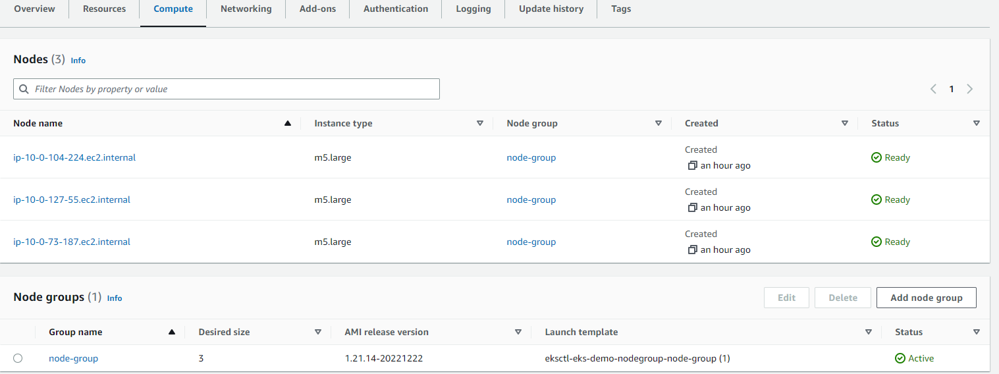

### (Option) Add Console Credential

```bash
kubectl describe configmap -n kube-system aws-auth

  - groups:
    - system:bootstrappers
    - system:nodes
    rolearn: arn:aws:iam::538679938307:role/eksctl-eks-demo-nodegroup-node-gr-NodeInstanceRole-1MJUR9YSDUCSH
    username: system:node:{{EC2PrivateDNSName}}
```

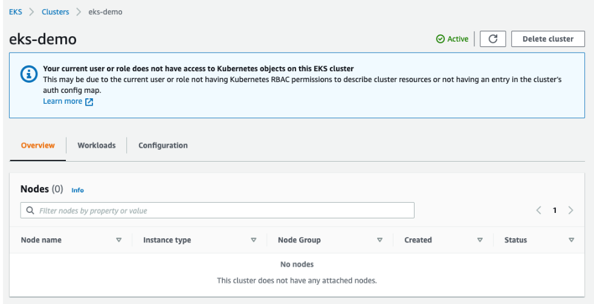

```bash
kubectl edit configmap -n kube-system aws-auth

mapUsers:
----
- userarn: arn:aws:iam::538679938307:user/iac
  username: iac
  groups:
  - system:masters
- userarn: arn:aws:iam::538679938307:root
  username: root
  groups:
  - system:masters
```

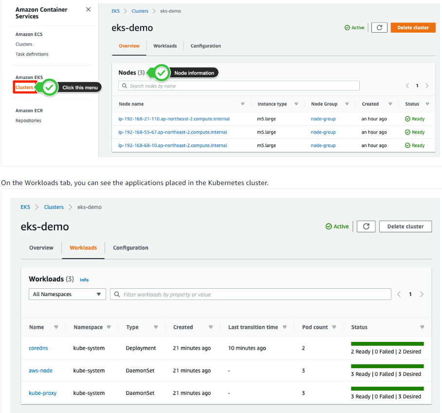

## Create Ingress Controller

Ingress is a rule and resource object that defines how to handle requests, primarily when accessing from outside the cluster to inside the Kubernetes cluster. In short, it serve as a gateway for external requests to access inside of the cluster. You can set up it for load balancing for external requests, processing TLS/SSL certificates, routing to HTTP routes, and so on. Ingress processes requests from the L7.

In Kubernetes, you can also externally expose to NodePort or LoadBalancer type in Service object, but if you use a Serivce object without any Ingress, you must consider detailed options such as routing rules and TLS/SSL to all services. That's why Ingress is needed in Kubernetes environment.

Ingress means the object that you have set up rules for handling external requests, and Ingress Controller is needed for these settings to work. Unlike other controllers that run as part of the kube-controller-manager, the ingress controller is not created with the cluster by nature. Therefore, you need to install it yourself.

### Create AWS Load Balancer Controller

The controller provisions the following resources.

- It satisfies Kubernetes Ingress resources by provisioning Application Load Balancers.
- It satisfies Kubernetes Service resources by provisioning Network Load Balancers.

The controller was formerly named the AWS ALB Ingress Controller. There are two traffic modes supported by each type of AWS Load Balancer controller:

- Instance(default): Register nodes in the cluster as targets for ALB. Traffic reaching the ALB is routed to NodePort and then proxied to the Pod.
- IP: Register the Pod as an ALB target. Traffic reaching the ALB is routed directly to the Pod. In order to use that traffic mode, you must explicitly specify it in the ingress.yaml file with comments.

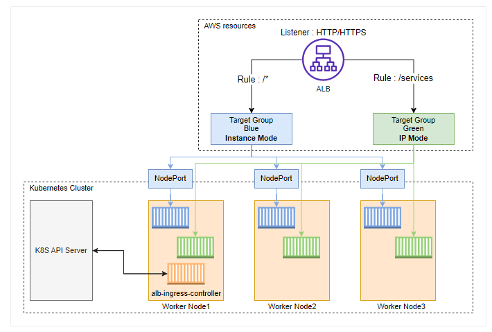

```bash
mkdir -p manifests/base/alb-ingress-controller && cd manifests/base/alb-ingress-controller
```

Before deploying the AWS Load Balancer controller, we need to do some things. Because the controller operates over the worker node, you must make it accessible to AWS ALB/NLB resources through IAM permissions. IAM permissions can install IAM Roles for ServiceAccount or attach directly to IAM Roles on the worker node.

- First, create IAM OpenID Connect (OIDC) identity provider for the cluster. IAM OIDC provider must exist in the cluster(in this lab, eks-demo) in order for objects created by Kubernetes to use service account  which purpose is to authenticate to API Server or external services.

```bash
eksctl utils associate-iam-oidc-provider \
    --region us-east-1 \
    --cluster eks-demo \
    --approve
aws eks describe-cluster --name eks-demo --query "cluster.identity.oidc.issuer" --output text --region us-east-1
```

```bash
aws iam list-open-id-connect-providers | grep 241FD0767CF78185EAA512D746DF65D6
```

- Create an IAM Policy to grant to the AWS Load Balancer Controller.

```bash
curl -o iam-policy.json https://raw.githubusercontent.com/kubernetes-sigs/aws-load-balancer-controller/v2.4.4/docs/install/iam_policy.json
aws iam create-policy \
    --policy-name AWSLoadBalancerControllerIAMPolicy \
    --policy-document file://iam-policy.json
```

- Create ServiceAccount for AWS Load Balancer Controller.

```bash
eksctl create iamserviceaccount \
    --cluster eks-demo \
    --namespace kube-system \
    --name aws-load-balancer-controller \
    --attach-policy-arn arn:aws:iam::538679938307:policy/AWSLoadBalancerControllerIAMPolicy \
    --override-existing-serviceaccounts \
    --approve --region us-east-1
```

- Add AWS Load Balancer controller to the cluster. First, install cert-manager  to insert the certificate configuration into the Webhook. Cert-manager is an open source that automatically provisions and manages TLS certificates within a Kubernetes cluster.

```bash
kubectl apply --validate=false -f https://github.com/jetstack/cert-manager/releases/download/v1.5.4/cert-manager.yaml
```

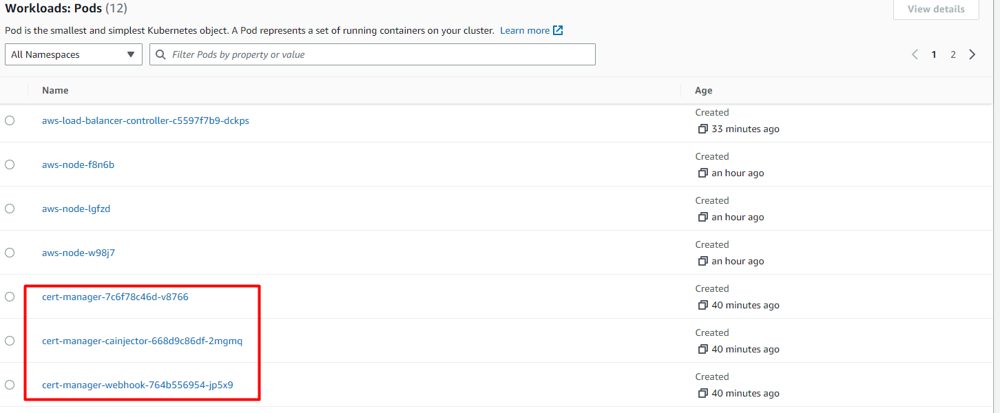

- Download Load balancer controller yaml file.

```bash
wget https://github.com/kubernetes-sigs/aws-load-balancer-controller/releases/download/v2.4.4/v2_4_4_full.yaml
```

- In yaml file, edit cluster-name to eks-demo.

```bash
spec:
    containers:
    - args:
        - --cluster-name=eks-demo # Insert EKS cluster that you created
        - --ingress-class=alb
        image: amazon/aws-alb-ingress-controller:v2.4.4
```

- And remove the ServiceAccount yaml spec written in the yaml file. This is because we have already created a ServiceAccount for AWS Load Balancer Controller. Delete the contents below and save the yaml file.

```bash
---
apiVersion: v1
kind: ServiceAccount
metadata:
  labels:
    app.kubernetes.io/component: controller
    app.kubernetes.io/name: aws-load-balancer-controller
  name: aws-load-balancer-controller
  namespace: kube-system
```

- Deploy AWS Load Balancer controller file.

```bash
kubectl apply -f v2_4_4_full.yaml
```

- Check that the deployment is successed and the controller is running through the command below. When the result is derived, it means success.

```bash
kubectl get deployment -n kube-system aws-load-balancer-controller
```

- In addition, the command below shows that service account has been created.

```bash
kubectl get sa aws-load-balancer-controller -n kube-system -o yaml
```

- Pods running inside the cluster for the necessary functions are called Addon(Các pod chạy bên trong cluster cho các chức năng cần thiết được gọi là Addon). Pods used for add-on are managed by the Deployment, Replication Controller, and so on. And the namespace that this add-on uses is kube-system. Because the namespace is specified as kube-system in the yaml file, it is successfully deployed when the pod name is derived from the command above. You can also check the relevant logs with the commands below.

```bash
kubectl logs -n kube-system $(kubectl get po -n kube-system | egrep -o "aws-load-balancer[a-zA-Z0-9-]+")
```

- Detailed property values are available with the commands below.

```bash
ALBPOD=$(kubectl get pod -n kube-system | egrep -o "aws-load-balancer[a-zA-Z0-9-]+")
kubectl describe pod -n kube-system ${ALBPOD}

Name:                 aws-load-balancer-controller-c5597f7b9-dckps
Namespace:            kube-system
Priority:             2000000000
Priority Class Name:  system-cluster-critical
Node:                 ip-10-0-127-55.ec2.internal/10.0.127.55
Start Time:           Fri, 06 Jan 2023 18:33:52 +0700
Labels:               app.kubernetes.io/component=controller
                      app.kubernetes.io/name=aws-load-balancer-controller
                      pod-template-hash=c5597f7b9
Annotations:          kubernetes.io/psp: eks.privileged
Status:               Running
IP:                   10.0.110.84
IPs:
  IP:           10.0.110.84
Controlled By:  ReplicaSet/aws-load-balancer-controller-c5597f7b9
Containers:
  controller:
    Container ID:  docker://34f7a232b2425ebf2cec82db36e9d017818afcd4d065395ee653b5f6e09d8036
    Image:         amazon/aws-alb-ingress-controller:v2.4.4
    Image ID:      docker-pullable://amazon/aws-alb-ingress-controller@sha256:29b6f9f936cf96c326d1a8a2ef88086962b63d30c691fb22c791d47382bf796e
    Port:          9443/TCP
    Host Port:     0/TCP
    Args:
      --cluster-name=eks-demo
      --ingress-class=alb
    State:          Running
      Started:      Fri, 06 Jan 2023 18:33:59 +0700
    Ready:          True
    Restart Count:  0
    Limits:
      cpu:     200m
      memory:  500Mi
    Requests:
      cpu:     100m
      memory:  200Mi
    Liveness:  http-get http://:61779/healthz delay=30s timeout=10s period=10s #success=1 #failure=2
    Environment:
      AWS_DEFAULT_REGION:           us-east-1
      AWS_REGION:                   us-east-1
      AWS_ROLE_ARN:                 arn:aws:iam::538679938307:role/eksctl-eks-demo-addon-iamserviceaccount-kube-Role1-THKLRR2YMNDG
      AWS_WEB_IDENTITY_TOKEN_FILE:  /var/run/secrets/eks.amazonaws.com/serviceaccount/token
    Mounts:
      /tmp/k8s-webhook-server/serving-certs from cert (ro)
      /var/run/secrets/eks.amazonaws.com/serviceaccount from aws-iam-token (ro)
      /var/run/secrets/kubernetes.io/serviceaccount from kube-api-access-7c8dm (ro)
Conditions:
  Type              Status
  Initialized       True 
  Ready             True 
  ContainersReady   True 
  PodScheduled      True 
Volumes:
  aws-iam-token:
    Type:                    Projected (a volume that contains injected data from multiple sources)
    TokenExpirationSeconds:  86400
  cert:
    Type:        Secret (a volume populated by a Secret)
    SecretName:  aws-load-balancer-webhook-tls
    Optional:    false
  kube-api-access-7c8dm:
    Type:                    Projected (a volume that contains injected data from multiple sources)
    TokenExpirationSeconds:  3607
    ConfigMapName:           kube-root-ca.crt
    ConfigMapOptional:       <nil>
    DownwardAPI:             true
QoS Class:                   Burstable
Node-Selectors:              <none>
Tolerations:                 node.kubernetes.io/not-ready:NoExecute op=Exists for 300s
                             node.kubernetes.io/unreachable:NoExecute op=Exists for 300s
Events:
  Type     Reason       Age                    From               Message
  ----     ------       ----                   ----               -------
  Normal   Scheduled    3m15s                  default-scheduler  Successfully assigned kube-system/aws-load-balancer-controller-c5597f7b9-dckps to ip-10-0-127-55.ec2.internal
  Warning  FailedMount  3m13s (x3 over 3m14s)  kubelet            MountVolume.SetUp failed for volume "cert" : secret "aws-load-balancer-webhook-tls" not found
  Normal   Pulling      3m10s                  kubelet            Pulling image "amazon/aws-alb-ingress-controller:v2.4.4"
  Normal   Pulled       3m8s                   kubelet            Successfully pulled image "amazon/aws-alb-ingress-controller:v2.4.4" in 1.320985643s
  Normal   Created      3m8s                   kubelet            Created container controller
  Normal   Started      3m8s                   kubelet            Started container controller
```

- Result:
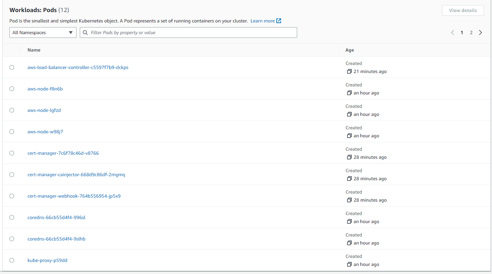

## Deploy Microservices

In this lab, you will learn how to deploy the backend, frontend to Amazon EKS, which makes up the web service. The order in which each service is deployed is as follows.

- Download source code from git repository
- Create a repository for each container image in Amazon ECR
- Build container image from source code location, including Dockerfile, and push to repository
- Create and deploy Deployment, Service, Ingress manifest files for each service.

```
Code -> ECR -> Deployment -> Service -> Ingress
```

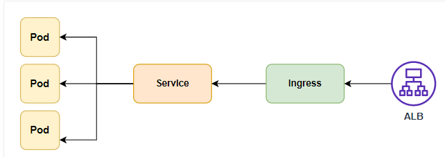

### Prepare

- Create ECR:
  - demo-flask-backend
  - demo-frontend
  - demo-nodejs-backend
- Push image to ECR:

```bash
aws ecr get-login-password --region us-east-1 | docker login --username AWS --password-stdin 538679938307.dkr.ecr.us-east-1.amazonaws.com
```

- demo-flask-backend

    ```bash
    cd amazon-eks-flask-master
    docker build -f Dockerfile -t "demo-flask-backend:latest" .
    docker tag demo-flask-backend:latest 538679938307.dkr.ecr.us-east-1.amazonaws.com/demo-flask-backend:latest
    docker push 538679938307.dkr.ecr.us-east-1.amazonaws.com/demo-flask-backend:latest
    ```

- demo-frontend(build image after replace ingress url & npm install/build)

- demo-nodejs-backend

    ```bash
    cd amazon-eks-nodejs-main
    docker build -f Dockerfile -t "demo-nodejs-backend:latest" .
    docker tag demo-nodejs-backend:latest 538679938307.dkr.ecr.us-east-1.amazonaws.com/demo-nodejs-backend:latest
    docker push 538679938307.dkr.ecr.us-east-1.amazonaws.com/demo-nodejs-backend:latest
    ```

### Deploy First Backend Service

#### Deploy flask backend

```bash
cd manifests/base
cat flask-deployment.yaml
cat flask-service.yaml
cat flask-ingress.yaml
kubectl apply -f flask-deployment.yaml
kubectl apply -f flask-service.yaml
kubectl apply -f flask-ingress.yaml
alb_url=$(kubectl get ingress/flask-backend-ingress -o jsonpath='{.status.loadBalancer.ingress[*].hostname}')
echo http://$alb_url/contents/aws

  http://k8s-eksdemogroup-e0353f9ab7-755424560.us-east-1.elb.amazonaws.com/contents/aws
  {
    "outcome": [
      {
        "id": "23309269", 
        "title": "AWS services explained in one line each", 
        "url": "https://adayinthelifeof.nl/2020/05/20/aws.html"
      }, 
      {
        "id": "29473630", 
        "title": "AWS us-east-1 outage", 
        "url": "https://status.aws.amazon.com/"
      }, 
      {
        "id": "24799660", 
        "title": "AWS forked my project and launched it as its own service", 
        "url": "https://twitter.com/tim_nolet/status/1317061818574082050"
      }, 
      {
        "id": "25865094", 
        "title": "AWS announces forks of Elasticsearch and Kibana", 
        "url": "https://aws.amazon.com/blogs/opensource/stepping-up-for-a-truly-open-source-elasticsearch"
      }, 
      {
        "id": "16970199", 
        "title": "Amazon threatens to suspend Signal's AWS account over censorship circumvention", 
        "url": "https://signal.org/blog/looking-back-on-the-front/"
      }, 
      {
        "id": "13072155", 
        "title": "Amazon LightSail: Simple Virtual Private Servers on AWS", 
        "url": "https://amazonlightsail.com/"
      }, 
      {
        "id": "27044371", 
        "title": "Please fix the AWS free tier before somebody gets hurt", 
        "url": "https://cloudirregular.substack.com/p/please-fix-the-aws-free-tier-before"
      }, 
      {
        "id": "28903982", 
        "title": "AWS is playing chess, Cloudflare is playing Go", 
        "url": "https://www.swyx.io/cloudflare-go/"
      }, 
      {
        "id": "24103746", 
        "title": "I want to have an AWS region where everything breaks with high frequency", 
        "url": "https://twitter.com/cperciva/status/1292260921893457920"
      }, 
      {
        "id": "27930151", 
        "title": "AWS's Egregious Egress", 
        "url": "https://blog.cloudflare.com/aws-egregious-egress/"
      }, 
      {
        "id": "26780848", 
        "title": "OpenSearch: AWS fork of Elasticsearch and Kibana", 
        "url": "https://aws.amazon.com/blogs/opensource/introducing-opensearch/"
      }, 
      {
        "id": "26252010", 
        "title": "Google Cloud vs. AWS Onboarding Comparison", 
        "url": "https://www.kevinslin.com/notes/ebd7fd65-988f-422a-93f5-b1fe5c3f29ce.html"
      }, 
      {
        "id": "15629308", 
        "title": "Earth on AWS \u2013 Open geospatial data", 
        "url": "https://aws.amazon.com/earth/"
      }, 
      {
        "id": "20614806", 
        "title": "Why I Turned Down an AWS Job Offer", 
        "url": "https://www.lastweekinaws.com/blog/why-i-turned-down-an-aws-job-offer-hn/"
      }, 
      {
        "id": "29516482", 
        "title": "Summary of the AWS Service Event in the Northern Virginia (US-East-1) Region", 
        "url": "https://aws.amazon.com/message/12721/"
      }, 
      {
        "id": "25267029", 
        "title": "AWS Lambda pricing now per ms", 
        "url": "https://aws.amazon.com/lambda/pricing/"
      }, 
      {
        "id": "33686168", 
        "title": "AWS and Blockchain", 
        "url": "https://www.tbray.org/ongoing/When/202x/2022/11/19/AWS-Blockchain"
      }, 
      {
        "id": "12993021", 
        "title": "Google Cloud is 50% cheaper than AWS", 
        "url": "https://thehftguy.wordpress.com/2016/11/18/google-cloud-is-50-cheaper-than-aws/"
      }
    ]
  }

kubectl get all

  NAME                                      READY   STATUS    RESTARTS   AGE
  pod/demo-flask-backend-5754d55b8b-cj5lb   1/1     Running   0          9m4s
  pod/demo-flask-backend-5754d55b8b-tzvc2   1/1     Running   0          9m4s
  pod/demo-flask-backend-5754d55b8b-vb2q8   1/1     Running   0          9m4s

  NAME                         TYPE        CLUSTER-IP     EXTERNAL-IP   PORT(S)          AGE
  service/demo-flask-backend   NodePort    172.20.230.0   <none>        8080:31346/TCP   10m
  service/kubernetes           ClusterIP   172.20.0.1     <none>        443/TCP          20h

  NAME                                 READY   UP-TO-DATE   AVAILABLE   AGE
  deployment.apps/demo-flask-backend   3/3     3            3           9m7s

  NAME                                            DESIRED   CURRENT   READY   AGE
  replicaset.apps/demo-flask-backend-5754d55b8b   3         3         3       9m8s
```

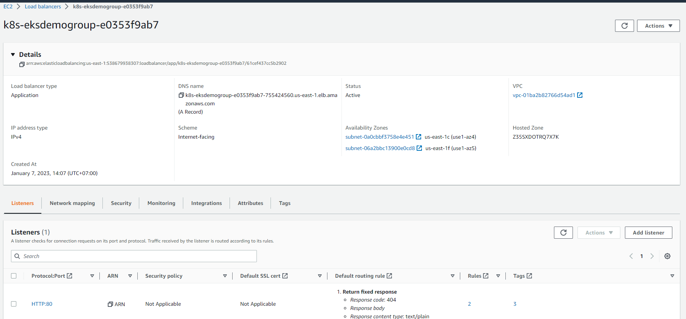
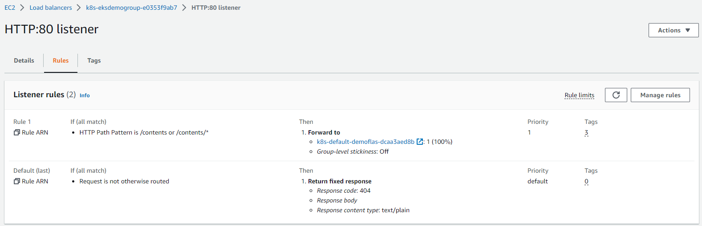
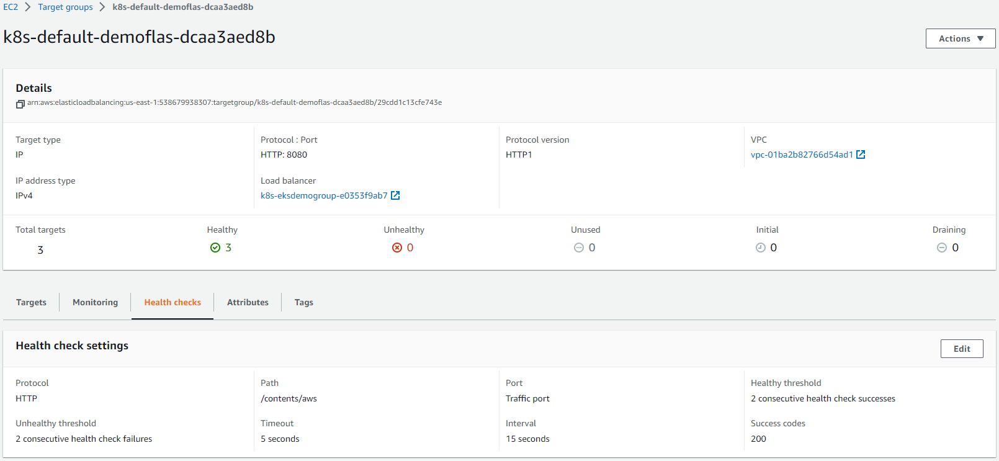
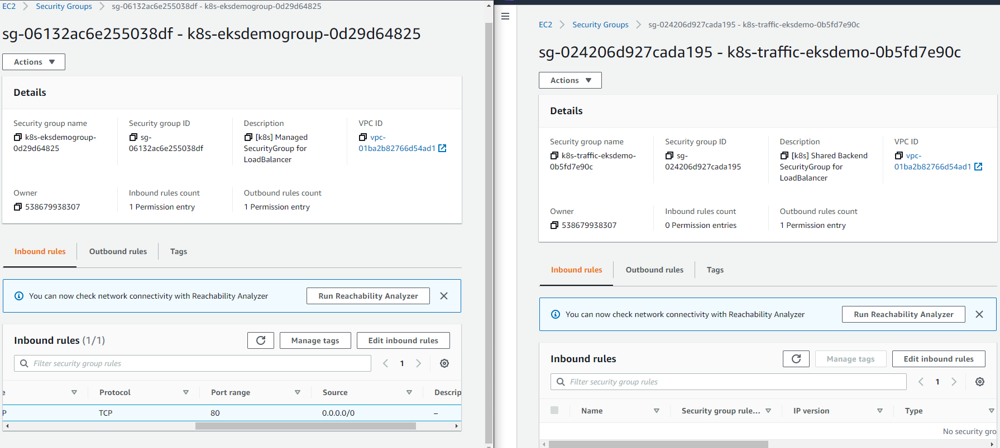
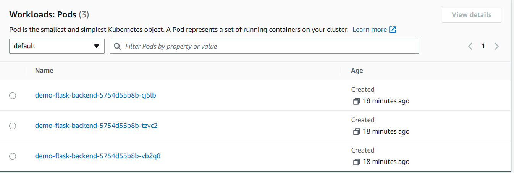

### Deploy Second Backend Service

#### Deploy Express backend

Deploy the express backend in the same order as the flask backend.
The lab below will deploy pre-built container images to skip the image build and repository push process conducted in Upload container image to Amazon ECR.

```bash
cat nodejs-deployment.yaml
cat nodejs-service.yaml
cat nodejs-ingress.yaml
kubectl apply -f nodejs-deployment.yaml
kubectl apply -f nodejs-service.yaml
kubectl apply -f nodejs-ingress.yaml
alb_url=$(kubectl get ingress/nodejs-backend-ingress -o jsonpath='{.status.loadBalancer.ingress[*].hostname}')
echo http://$alb_url/services/all

  http://k8s-eksdemogroup-e0353f9ab7-755424560.us-east-1.elb.amazonaws.com/services/all
  {"outcome":[{"name":"AWS","url":"https://first-demo-static-web.s3-ap-southeast-1.amazonaws.com/images/demo-image-0.png","value":"Amazon Web Services(AWS)","link":"https://aws.amazon.com/ko/?nc2=h_lg"},{"name":"Amazon ECR","url":"https://first-demo-static-web.s3-ap-southeast-1.amazonaws.com/images/demo-image-1.png","value":"Amazon Elastic Container Registry","link":"https://aws.amazon.com/ko/ecr/"},{"name":"Amazon EKS","url":"https://first-demo-static-web.s3-ap-southeast-1.amazonaws.com/images/demo-image-2.png","value":"Amazon Elastic Kubernetes Service","link":"https://aws.amazon.com/ko/eks/"},{"name":"Amazon ECS","url":"https://first-demo-static-web.s3-ap-southeast-1.amazonaws.com/images/demo-image-3.png","value":"Amazon Elastic Container Service","link":"https://aws.amazon.com/ko/ecs/"},{"name":"AWS Fargate","url":"https://first-demo-static-web.s3-ap-southeast-1.amazonaws.com/images/demo-image-4.png","value":"Serverless compute for containers","link":"https://aws.amazon.com/ko/fargate/"},{"name":"Amazon Cloud9","url":"https://first-demo-static-web.s3-ap-southeast-1.amazonaws.com/images/demo-image-5.png","value":"A cloud IDE for writing, running, and debugging code","link":"https://aws.amazon.com/ko/cloud9/"},{"name":"AWS CloudFormation","url":"https://first-demo-static-web.s3-ap-southeast-1.amazonaws.com/images/demo-image-6.png","value":"Speed up cloud provisioning with infrastructure as code","link":"https://aws.amazon.com/ko/cloudformation/"}]}

kubectl get all

  NAME                                       READY   STATUS    RESTARTS   AGE
  pod/demo-flask-backend-5754d55b8b-cj5lb    1/1     Running   0          30m
  pod/demo-flask-backend-5754d55b8b-tzvc2    1/1     Running   0          30m
  pod/demo-flask-backend-5754d55b8b-vb2q8    1/1     Running   0          30m
  pod/demo-nodejs-backend-7b5c469d54-458nn   1/1     Running   0          93s
  pod/demo-nodejs-backend-7b5c469d54-sfhvc   1/1     Running   0          93s
  pod/demo-nodejs-backend-7b5c469d54-th4pm   1/1     Running   0          93s

  NAME                          TYPE        CLUSTER-IP       EXTERNAL-IP   PORT(S)          AGE
  service/demo-flask-backend    NodePort    172.20.230.0     <none>        8080:31346/TCP   31m
  service/demo-nodejs-backend   NodePort    172.20.252.177   <none>        8080:31657/TCP   91s
  service/kubernetes            ClusterIP   172.20.0.1       <none>        443/TCP          21h

  NAME                                  READY   UP-TO-DATE   AVAILABLE   AGE
  deployment.apps/demo-flask-backend    3/3     3            3           30m
  deployment.apps/demo-nodejs-backend   3/3     3            3           96s

  NAME                                             DESIRED   CURRENT   READY   AGE
  replicaset.apps/demo-flask-backend-5754d55b8b    3         3         3       30m
  replicaset.apps/demo-nodejs-backend-7b5c469d54   3         3         3       97s
```

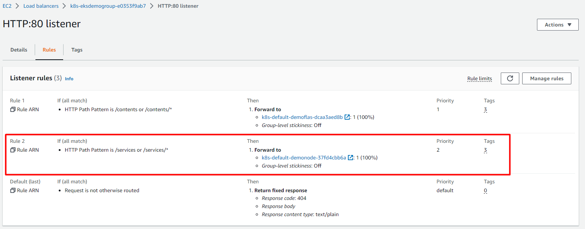
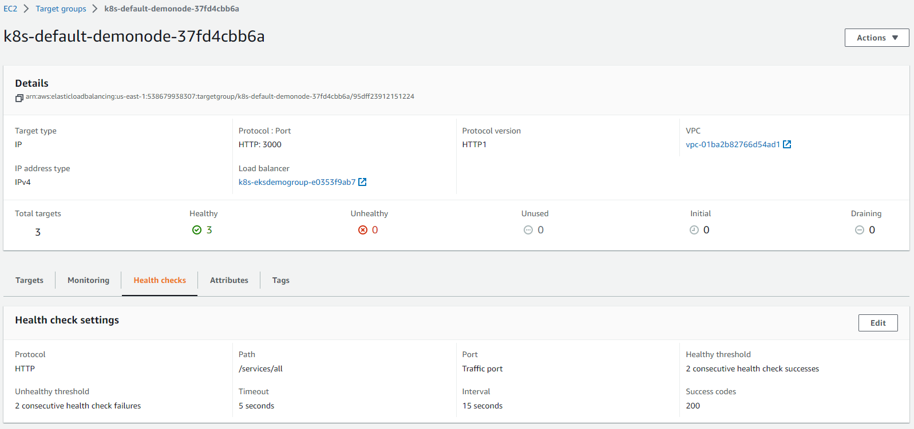
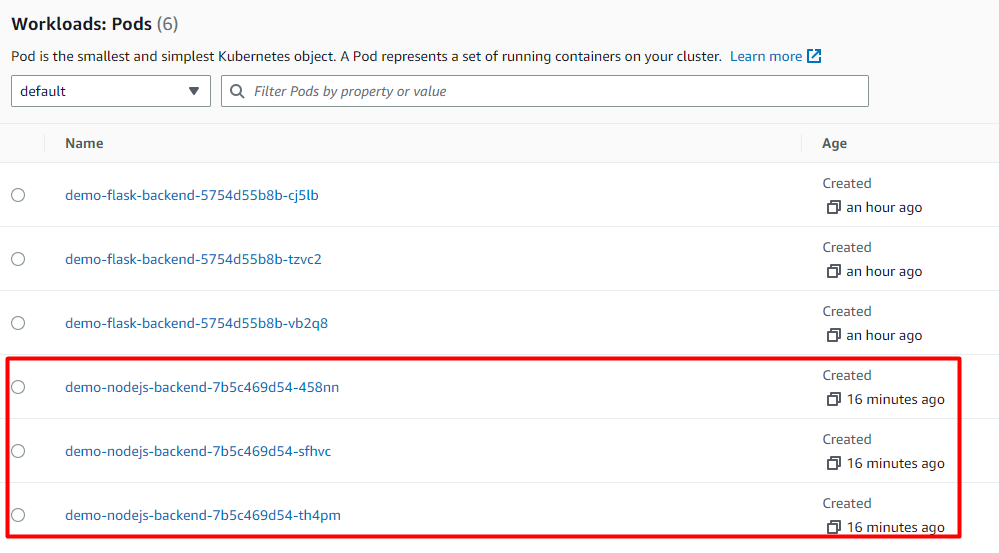

### Deploy Frontend Service

#### Deploy React Frontend

Once you have deployed two backend services, you will now deploy the frontend to configure the web page's screen.

- To spray two backend API data on the web screen, we have to change source code. Change the url values in App.js file and page/upperPage.js file from the frontend source code(location: amazon-eks-frontend).
  - At App.js, line 44 change from `{backend-ingress ADDRESS}` to `k8s-eksdemogroup-e0353f9ab7-755424560.us-east-1.elb.amazonaws.com`
  - At page/upperPage.js, line 33 change from `{backend-ingress ADDRESS}` to `k8s-eksdemogroup-e0353f9ab7-755424560.us-east-1.elb.amazonaws.com`
- Execute the following command in the location of the amazon-eks-frontend folder.

```bash
cd amazon-eks-frontend-main
npm install
npm run build
```

- [!] After npm install, if severity vulnerability comes out, perform the npm audit fix command and apply npm run build.

```bash
npm audit fix --force
npm run build
```

- Build image

```bash
docker build -f Dockerfile -t "demo-frontend:latest" .
docker tag demo-frontend:latest 538679938307.dkr.ecr.us-east-1.amazonaws.com/demo-frontend:latest
docker push 538679938307.dkr.ecr.us-east-1.amazonaws.com/demo-frontend:latest
```

```bash
cd manifests/base
cat frontend-deployment.yaml
cat frontend-service.yaml
cat frontend-ingress.yaml
kubectl apply -f frontend-deployment.yaml
kubectl apply -f frontend-service.yaml
kubectl apply -f frontend-ingress.yaml
alb_url=$(kubectl get ingress/frontend-ingress -o jsonpath='{.status.loadBalancer.ingress[*].hostname}')
echo http://$alb_url

  http://k8s-eksdemogroup-e0353f9ab7-755424560.us-east-1.elb.amazonaws.com

kubectl get all
  NAME                                       READY   STATUS    RESTARTS   AGE
  pod/demo-flask-backend-5754d55b8b-cj5lb    1/1     Running   0          92m
  pod/demo-flask-backend-5754d55b8b-tzvc2    1/1     Running   0          92m
  pod/demo-flask-backend-5754d55b8b-vb2q8    1/1     Running   0          92m
  pod/demo-frontend-5f588fb44b-9l9ll         1/1     Running   0          2m22s
  pod/demo-frontend-5f588fb44b-bvppk         1/1     Running   0          2m22s
  pod/demo-frontend-5f588fb44b-vf52l         1/1     Running   0          2m22s
  pod/demo-nodejs-backend-7b5c469d54-458nn   1/1     Running   0          63m
  pod/demo-nodejs-backend-7b5c469d54-sfhvc   1/1     Running   0          63m
  pod/demo-nodejs-backend-7b5c469d54-th4pm   1/1     Running   0          63m

  NAME                          TYPE        CLUSTER-IP       EXTERNAL-IP   PORT(S)          AGE
  service/demo-flask-backend    NodePort    172.20.230.0     <none>        8080:31346/TCP   94m
  service/demo-frontend         NodePort    172.20.211.20    <none>        80:30212/TCP     2m21s
  service/demo-nodejs-backend   NodePort    172.20.252.177   <none>        8080:31657/TCP   63m
  service/kubernetes            ClusterIP   172.20.0.1       <none>        443/TCP          22h

  NAME                                  READY   UP-TO-DATE   AVAILABLE   AGE
  deployment.apps/demo-flask-backend    3/3     3            3           92m
  deployment.apps/demo-frontend         3/3     3            3           2m25s
  deployment.apps/demo-nodejs-backend   3/3     3            3           64m

  NAME                                             DESIRED   CURRENT   READY   AGE
  replicaset.apps/demo-flask-backend-5754d55b8b    3         3         3       92m
  replicaset.apps/demo-frontend-5f588fb44b         3         3         3       2m26s
  replicaset.apps/demo-nodejs-backend-7b5c469d54   3         3         3       64m
```

Note: Can use `kubectl rollout restart deployment/demo-frontend` to redeploy app

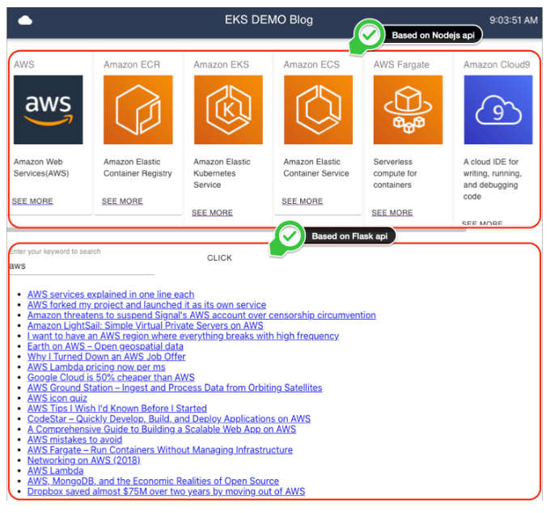
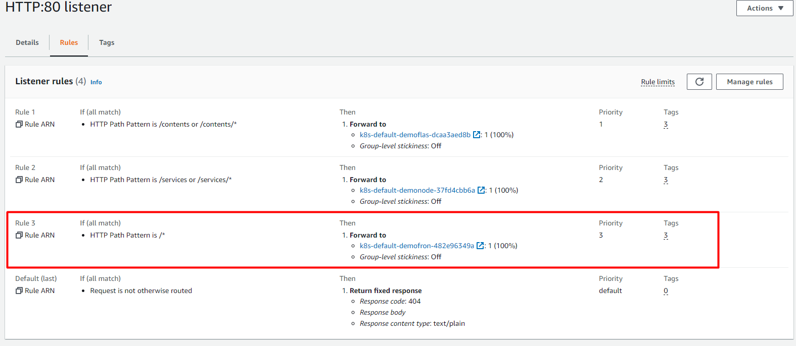
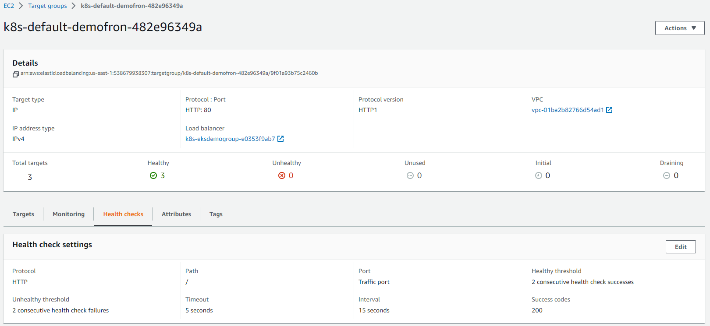
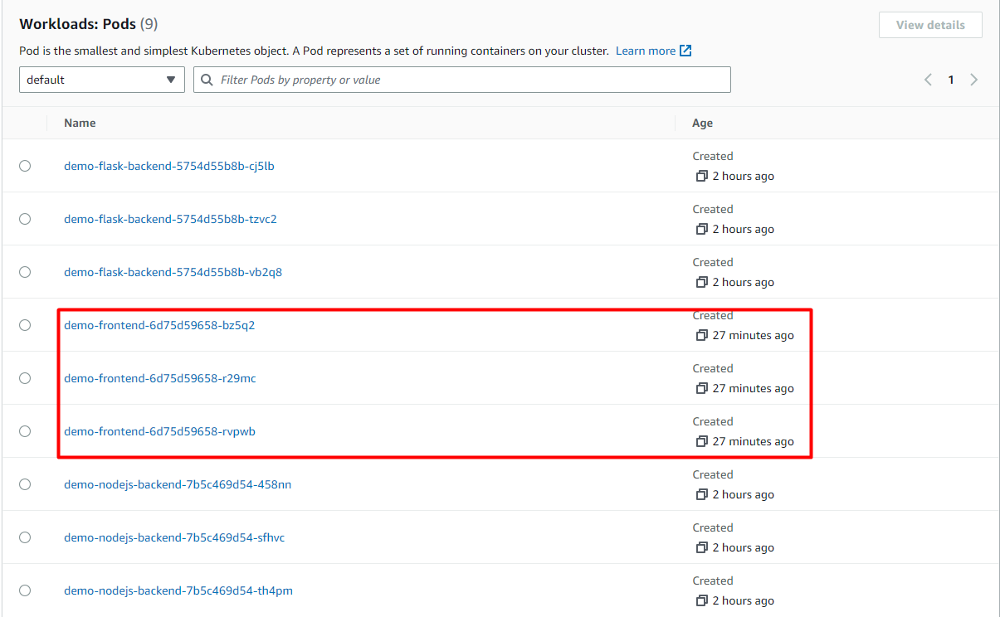

## AWS Fargate

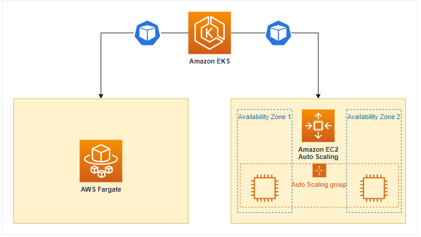

### Deploy service with AWS Fargate

#### Deploy pod with AWS Fargate

- To deploy pods to Fargate in a cluster, you must define at least one fargate profile that the pod uses when it runs. In other words, the fargate profile is a profile that specifies the conditions for creating pods with AWS Fargate type.

```bash
cat eks-demo-fargate-profile.yaml
```

For pods that meet the conditions listed in selectors in the yaml file above, it will be deployed as AWS Fargate type.

- Deploy fargate profile.

```bash
eksctl create fargateprofile -f eks-demo-fargate-profile.yaml                         
```

- Check whether fargate profile was deployed successfully.

```bash
eksctl get fargateprofile --cluster eks-demo -o json --region us-east-1

  [
      {
          "name": "frontend-fargate-profile",
          "podExecutionRoleARN": "arn:aws:iam::538679938307:role/eksctl-eks-demo-fargate-FargatePodExecutionRole-14KUE8M65BCT1",
          "selectors": [
              {
                  "namespace": "default",
                  "labels": {
                      "app": "frontend-fargate"
                  }
              }
          ],
          "subnets": [
              "subnet-0b87f0d7411700da9",
              "subnet-0a9224003e99fd2c5"
          ],
          "status": "ACTIVE"
      }
  ]
```

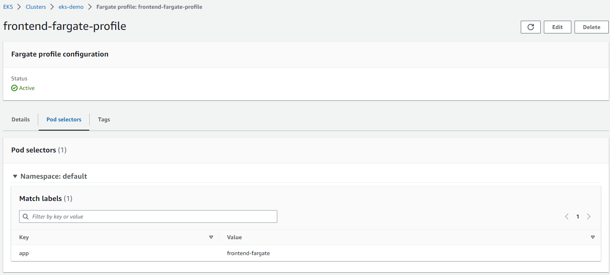

- In this lab, we will provision frontend pods to Fargate type. First, delete the existing frontend pod. Work with the command below in the folder where the yaml file is located.

```bash
kubectl delete -f frontend-deployment.yaml 
```

- Create frontend-deployment-fargate.yaml file. Compared with previous yaml file, you can see that the value of label changed from demo-frontend to frontend-fargate. In step 1, when the pod meet the condition that key=app, value=frontend-fargate and namespace=default, eks cluster deploy pod to Fargate type.

```bash
cat frontend-deployment-fargate.yaml
```

- Create frontend-service-fargate.yaml file.

```bash
cat frontend-service-fargate.yaml
```

- Deploy manifest file.

```bash
kubectl apply -f frontend-deployment-fargate.yaml
kubectl apply -f frontend-service-fargate.yaml
```

- With the command below, you can see that demo-frontend pods are provisioned at fargate-ip-XX.

```bash
kubectl get pod -o wide

  demo-frontend-78c4757ff7-49d5p         0/1     Pending   0          18s    <none>         <none>                         d47ced2e3a-d7ba6954c7ae4dd899f27864db777523   <none>
  demo-frontend-78c4757ff7-4tflq         0/1     Pending   0          18s    <none>         <none>                         d47ced2e3a-485be280b5a640429a21f099d293b57d   <none>
  demo-frontend-78c4757ff7-9dhsz         0/1     Pending   0          18s    <none>         <none>                         454b48968b-66d4f12d648c4e28ab57e91679e1ba96   <none>

  NAME                                   READY   STATUS    RESTARTS   AGE    IP             NODE                                   NOMINATED NODE   READINESS GATES
  demo-flask-backend-5754d55b8b-cj5lb    1/1     Running   0          175m   10.0.102.144   ip-10-0-127-55.ec2.internal            <none>           <none>
  demo-flask-backend-5754d55b8b-tzvc2    1/1     Running   0          175m   10.0.101.246   ip-10-0-104-224.ec2.internal           <none>           <none>
  demo-flask-backend-5754d55b8b-vb2q8    1/1     Running   0          175m   10.0.85.242    ip-10-0-73-187.ec2.internal            <none>           <none>
  demo-frontend-78c4757ff7-49d5p         1/1     Running   0          78s    10.0.67.170    fargate-ip-10-0-67-170.ec2.internal    <none>           <none>
  demo-frontend-78c4757ff7-4tflq         1/1     Running   0          78s    10.0.79.191    fargate-ip-10-0-79-191.ec2.internal    <none>           <none>
  demo-frontend-78c4757ff7-9dhsz         1/1     Running   0          78s    10.0.121.182   fargate-ip-10-0-121-182.ec2.internal   <none>           <none>
  demo-nodejs-backend-7b5c469d54-458nn   1/1     Running   0          146m   10.0.104.71    ip-10-0-104-224.ec2.internal           <none>           <none>
  demo-nodejs-backend-7b5c469d54-sfhvc   1/1     Running   0          146m   10.0.122.201   ip-10-0-127-55.ec2.internal            <none>           <none>
  demo-nodejs-backend-7b5c469d54-th4pm   1/1     Running   0          146m   10.0.93.70     ip-10-0-73-187.ec2.internal            <none>           <none>
```

- Or, you can check the list of Fargate worker nodes by following command.

```bash
kubectl get nodes -l eks.amazonaws.com/compute-type=fargate

  NAME                                   STATUS   ROLES    AGE    VERSION
  fargate-ip-10-0-121-182.ec2.internal   Ready    <none>   100s   v1.21.14-eks-1558457
  fargate-ip-10-0-67-170.ec2.internal    Ready    <none>   107s   v1.21.14-eks-1558457
  fargate-ip-10-0-79-191.ec2.internal    Ready    <none>   104s   v1.21.14-eks-1558457

alb_url=$(kubectl get ingress/frontend-ingress -o jsonpath='{.status.loadBalancer.ingress[*].hostname}')
echo http://$alb_url
```

## Explore Container Insights

### Amazon CloudWatch Container Insight

Use CloudWatch Container Insights to collect, aggregate, and summarize metrics and logs from your containerized applications and microservices. Container Insights is available for Amazon Elastic Container Service (Amazon ECS), Amazon Elastic Kubernetes Service (Amazon EKS), and Kubernetes platforms on Amazon EC2. Amazon ECS support includes support for Fargate.

CloudWatch automatically collects metrics for many resources, such as CPU, memory, disk, and network. Container Insights also provides diagnostic information, such as container restart failures, to help you isolate issues and resolve them quickly. You can also set CloudWatch alarms on metrics that Container Insights collects.

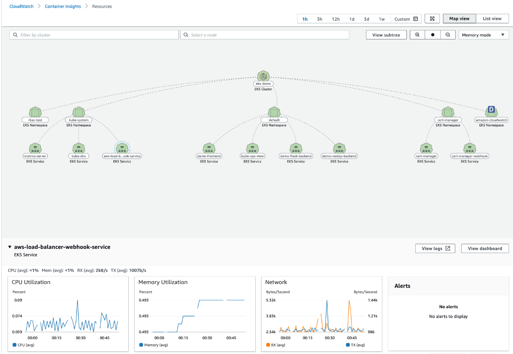

### Explorer EKS CloudWatch Container Insights

In this lab, you will use Fluent Bit  to route logs. The lab order will install CloudWatch Agent to collect metric of the cluster and Fluent Bit to send logs to CloudWatch Logs in DaemonSet type.

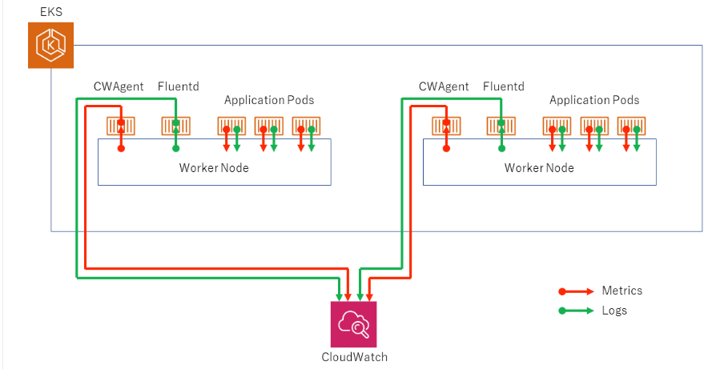

#### Install CloudWatch agent, Fluent Bit

```bash
mkdir -p manifests/base/cloudwatch-insight && cd manifests/base/cloudwatch-insight
```

- Create namespace named amazon-cloudwatch by following command.

```bash
kubectl create ns amazon-cloudwatch
kubectl get ns
```

-download yaml file.

```bash
wget https://raw.githubusercontent.com/aws-samples/amazon-cloudwatch-container-insights/latest/k8s-deployment-manifest-templates/deployment-mode/daemonset/container-insights-monitoring/quickstart/cwagent-fluent-bit-quickstart.yaml
```

- Open this yaml file, find DaemonSet object which name is fluent-bit and add the values below the spec at line 479:

```bash
      affinity:
        nodeAffinity:
          requiredDuringSchedulingIgnoredDuringExecution:
            nodeSelectorTerms:
            - matchExpressions:
              - key: eks.amazonaws.com/compute-type
                operator: NotIn
                values:
                - fargate
```

- Deploy yaml file.

```bash
kubectl apply -f cwagent-fluent-bit-quickstart.yaml 
kubectl get po -n amazon-cloudwatch

  NAME                     READY   STATUS    RESTARTS   AGE
  cloudwatch-agent-657jn   1/1     Running   0          66s
  cloudwatch-agent-dj248   1/1     Running   0          66s
  cloudwatch-agent-n9vck   1/1     Running   0          66s
  fluent-bit-57jgc         1/1     Running   0          58s
  fluent-bit-kz925         1/1     Running   0          58s
  fluent-bit-mmv6p         1/1     Running   0          58s

kubectl get daemonsets -n amazon-cloudwatch

  NAME               DESIRED   CURRENT   READY   UP-TO-DATE   AVAILABLE   NODE SELECTOR   AGE
  cloudwatch-agent   3         3         3       3            3           <none>          51s
  fluent-bit         3         3         3       3            3           <none>          43s
```

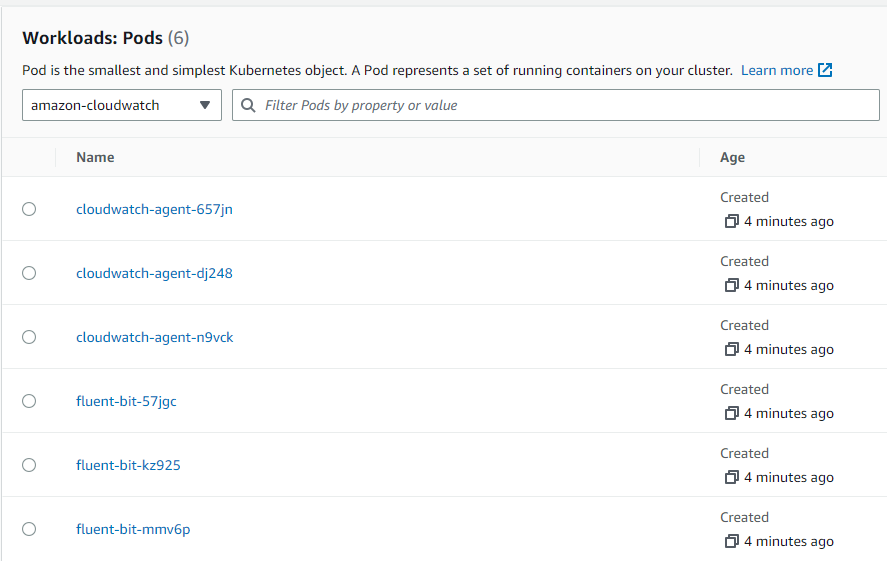
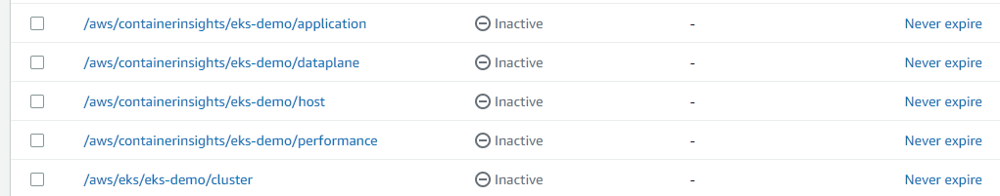
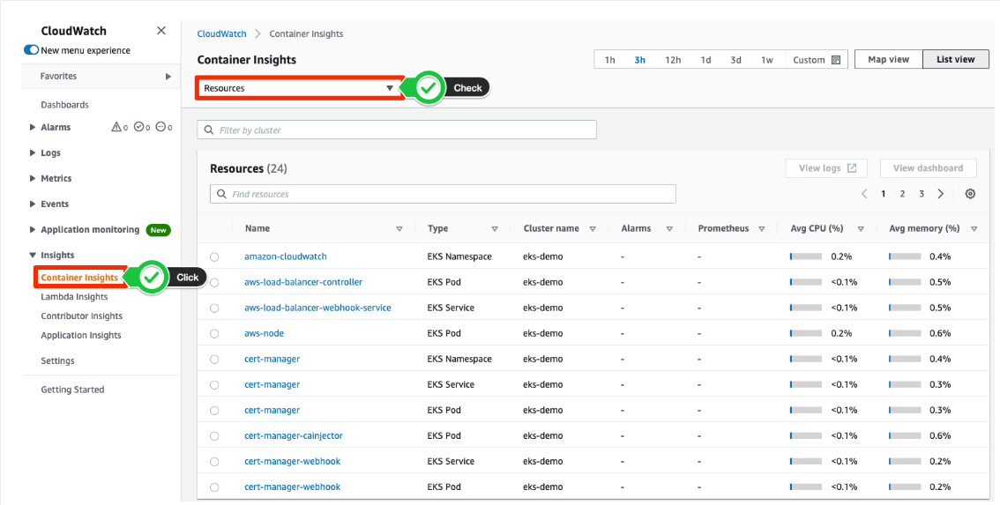
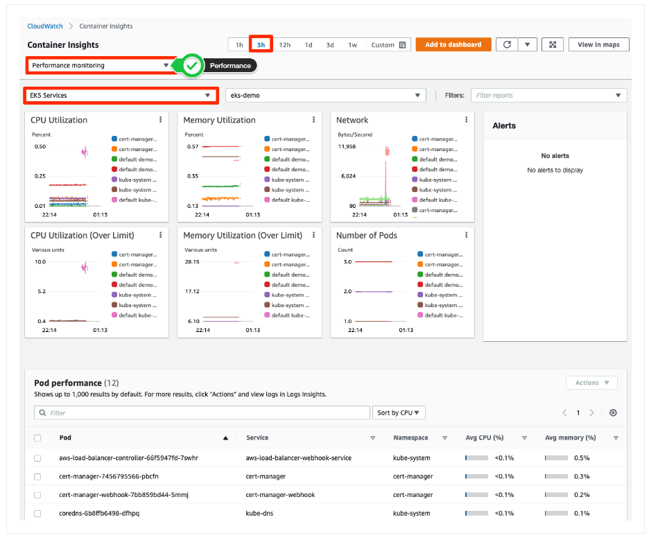
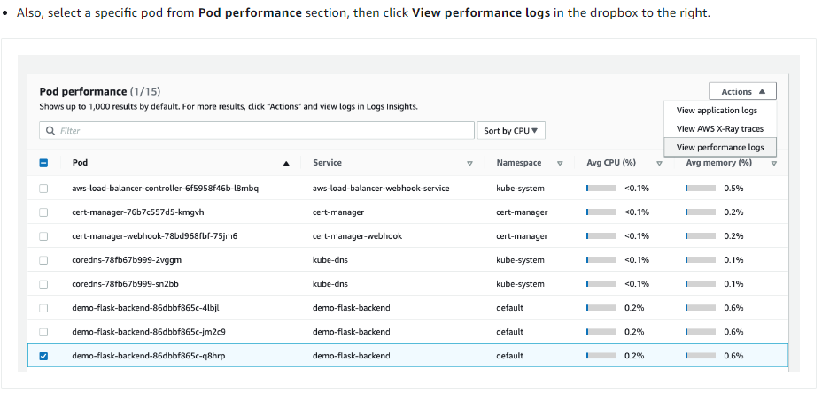
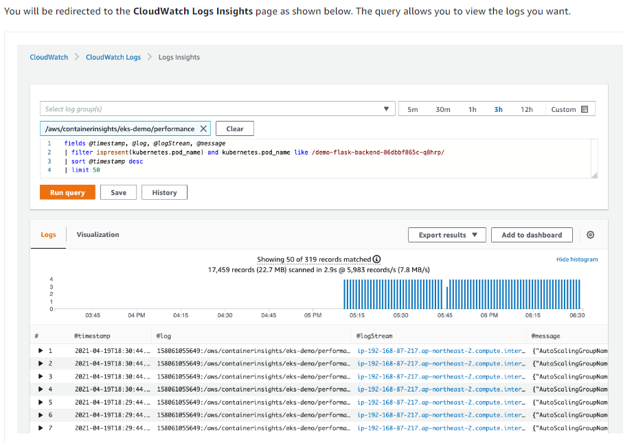

## Autoscaling Pod & Cluster

### Kubernetes Auto Scaling

Auto scaling service means that the ability to automatically create or delete servers based on user-defined cycles and events. Auto scaling enables applications to respond flexibly to traffic.

Kubernetis has two main auto-scaling capabilities.

HPA(Horizontal Pod AutoScaler)
Cluster Autoscaler
HPA automatically scales the number of pods by observing CPU usage or custom metrics. However, if you run out of EKS cluster's own resources to which the pod goes up, consider Cluster Autoscaler.

Applying these auto-scaling capabilities to a cluster allows you to configure a more resilient and scalable environment.

### Apply HPA

#### Applying Pod Scaling with HPA

The HPA(Horizontal Pod Autoscaler) controller allocates the number of pods based on metric. To apply pod scaling, you must specify the amount of resources required for the container and create conditions to scale through HPA.

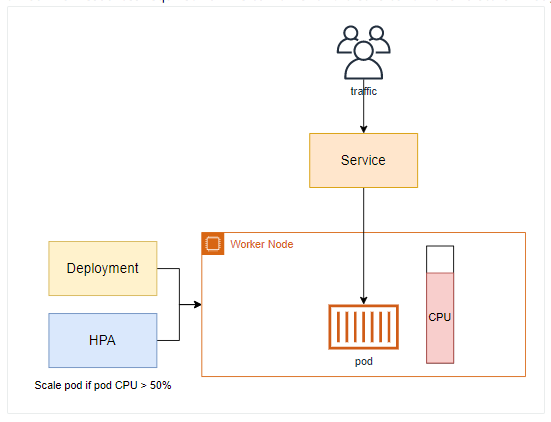

- Create metrics server. Metrics Server aggregates resource usage data across the Kubernetes cluster. Collect metrics such as the CPU and memory usage of the worker node or container through kubelet installed on each worker node.

```bash
kubectl apply -f https://github.com/kubernetes-sigs/metrics-server/releases/latest/download/components.yaml
kubectl get deployment metrics-server -n kube-system
```

- And then, modify flask deployment yaml file that you created in Deploy First Backend Service. Change replicas to 1 and set the amount of resources required for the container.

```bash
cat flask-deployment.yaml
```

- Apply the yaml file to reflect the changes.

```bash
kubectl apply -f flask-deployment.yaml
```

- Deploy yaml file.

```bash
cat flask-hpa.yaml
kubectl apply -f flask-hpa.yaml
kubectl get hpa
```

(You can set to this with simple kubectl command: `kubectl autoscale deployment demo-flask-backend --cpu-percent=30 --min=1 --max=5`)

- Perform a simple load test to check that the autoscaling functionality is working properly. First, enter the command below to understand the amount of change in the pod.

```bash
kubectl get hpa -w
```

- In addition, create additional terminals for load testing in AWS Cloud9. HTTP load testing through siege tool.

```bash
sudo yum -y install siege
export flask_api=$(kubectl get ingress/flask-backend-ingress -o jsonpath='{.status.loadBalancer.ingress[*].hostname}')/contents/aws
siege -c 200 -i http://$flask_api
```

- As shown in the screen below, you can load one side terminal and observe the amount of change in the pod accordingly on the other side. You can see that the REPLICAS value changes by up to 5 depending on the load.

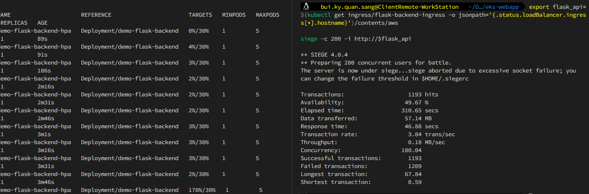

### Apply Cluster Autoscaler

#### Applying Cluster Scaling with Cluster Autoscaler

Auto scaling was applied to the pod on the previous chapter. However, depending on the traffic, there may be insufficient Worker Node resources for the pod to increase. In other words, it's full of Worker Nodes' capacity and no more pod can't be scheduled. At this point, what we use is Cluster Autoscaler(CA).

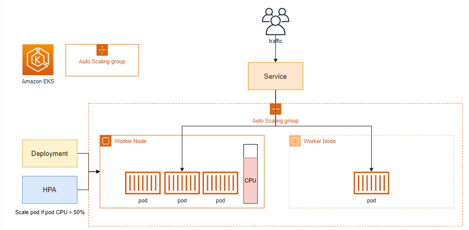

Cluster Autoscaler(CA) scales out the worker node if a pod in the pending state exists. Perform scale-in/out by checking utilization at intervals of a particular time. AWS also uses Auto Scaling Group to apply Cluster Autoscaler.

[!] (Optional) To visualize the status of the current cluster, see kube-ops-view .

```bash
curl -sSL https://raw.githubusercontent.com/helm/helm/master/scripts/get-helm-3 | bash
helm version --short
helm repo add stable https://charts.helm.sh/stable
helm search repo stable
helm install kube-ops-view \
stable/kube-ops-view \
--set service.type=LoadBalancer \
--set rbac.create=True
helm list
kubectl get svc kube-ops-view | tail -n 1 | awk '{ print "Kube-ops-view URL = http://"$4 }'
```

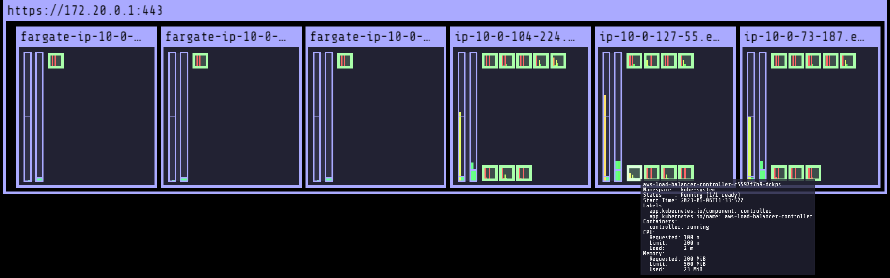
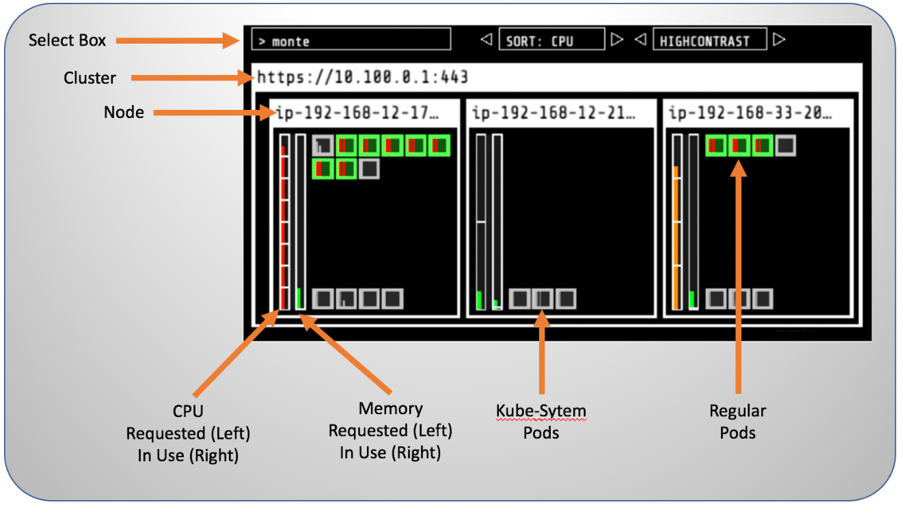

- Use the command below to check the value of ASG(Auto Scaling Group) applied to the current cluster's worker nodes.

```bash
aws autoscaling \
    describe-auto-scaling-groups \
    --query "AutoScalingGroups[? Tags[? (Key=='eks:cluster-name') && Value=='eks-demo']].[AutoScalingGroupName, MinSize, MaxSize,DesiredCapacity]" \
    --output table --region us-east-1

------------------------------------------------------------------------
|                       DescribeAutoScalingGroups                      |
+-------------------------------------------------------+----+----+----+
|  eks-node-group-80c2c357-3a4a-222b-7616-55af7d541657  |  3 |  3 |  3 |
+-------------------------------------------------------+----+----+----+
```

- Create IAM Policy named ClusterAutoScaler. Click Create policy button and paste policy in JSON tab.

```
{
    "Version": "2012-10-17",
    "Statement": [
        {
            "Effect": "Allow",
            "Action": [
                "autoscaling:DescribeAutoScalingGroups",
                "autoscaling:DescribeAutoScalingInstances",
                "autoscaling:DescribeLaunchConfigurations",
                "autoscaling:DescribeTags",
                "autoscaling:SetDesiredCapacity",
                "autoscaling:TerminateInstanceInAutoScalingGroup",
                "ec2:DescribeLaunchTemplateVersions"
            ],
            "Resource": "*"
        }
    ]
}
```

- Click Node IAM Role ARN to connect to the IAM console, and attach the Cluster AutoScaler policy to that IAM Role.

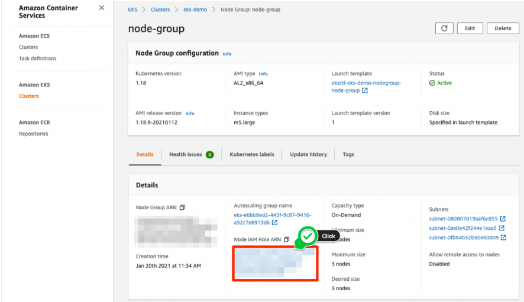

- click ASG applied in worker node, and update Group details value same as below.

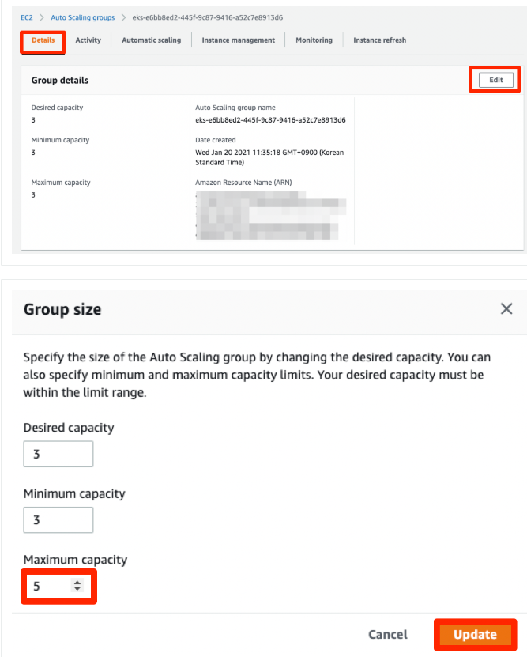

- download the deployment example file provided by the Cluster Atuoscaler project

```bash
wget https://raw.githubusercontent.com/kubernetes/autoscaler/master/cluster-autoscaler/cloudprovider/aws/examples/cluster-autoscaler-autodiscover.yaml
```

- Open the downloaded yaml file, set the cluster name(eks-demo), and deploy it.

```bash
...          
        command:
            - ./cluster-autoscaler
            - --v=4
            - --stderrthreshold=info
            - --cloud-provider=aws
            - --skip-nodes-with-local-storage=false
            - --expander=least-waste
            - --node-group-auto-discovery=asg:tag=k8s.io/cluster-autoscaler/enabled,k8s.io/cluster-autoscaler/eks-demo
...

kubectl apply -f cluster-autoscaler-autodiscover.yaml
```

- Perform a simple load test to check that the autoscaling functionality is working properly. First, enter the command below to understand the change in the number of worker nodes.

```bash
kubectl get nodes -w
```

- Then turn on the new terminal, and then perform a command to deploy 100 pods to increase the worker node.

```bash
kubectl create deployment autoscaler-demo --image=nginx
kubectl scale deployment autoscaler-demo --replicas=100
```

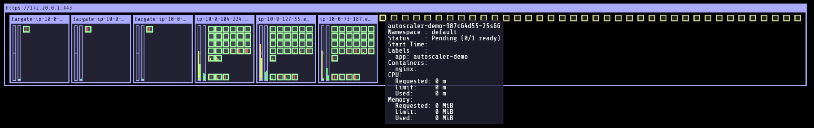
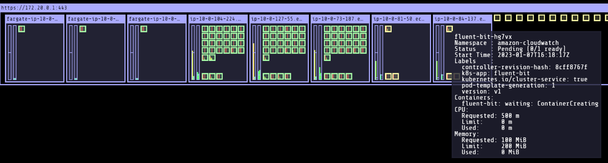
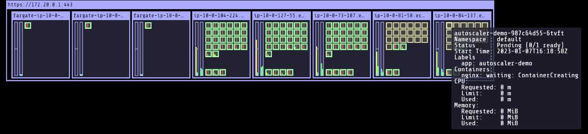
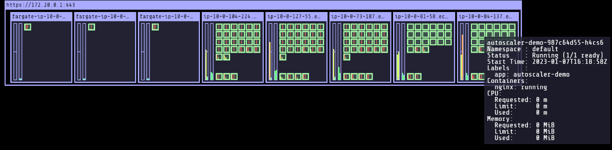

- To check the progress of the pod's deployment, perform the following command.

```bash
kubectl get deployment autoscaler-demo --watch
```

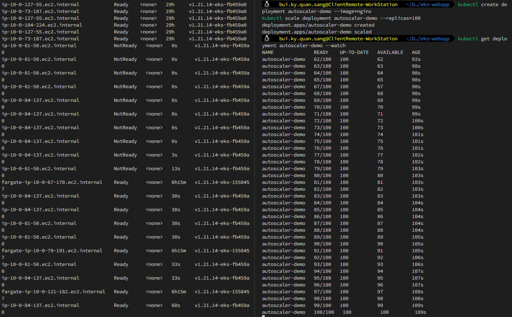

- If you delete a previously created pods with the command below, you can see that the worker node will be scaled in.

```bash
kubectl delete deployment autoscaler-demo
```

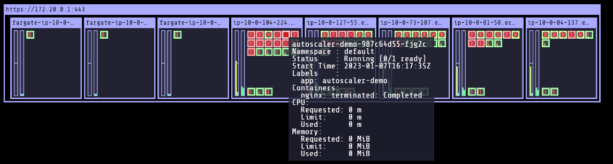

- Scale in from 5 -> 3

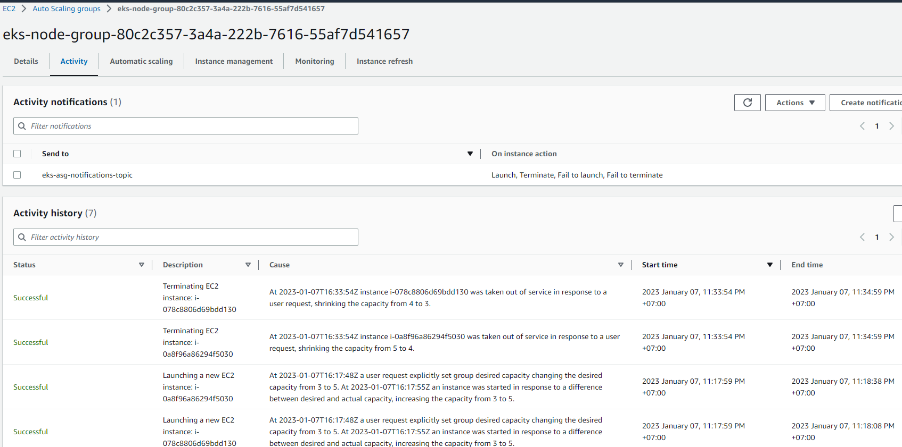

- Test scale in from 3 -> 1: All pods running in the nodegroups have terminated are migrated to the remaining nodegroup

```
NAME                                       READY   STATUS    RESTARTS   AGE
pod/demo-flask-backend-788c6f99f4-7z958    1/1     Running   0          5m52s
pod/demo-frontend-78c4757ff7-49d5p         1/1     Running   0          7h3m
pod/demo-frontend-78c4757ff7-4tflq         1/1     Running   0          7h3m
pod/demo-frontend-78c4757ff7-9dhsz         1/1     Running   0          7h3m
pod/demo-nodejs-backend-7b5c469d54-gnv5k   1/1     Running   0          5m52s
pod/demo-nodejs-backend-7b5c469d54-nkzzv   1/1     Running   0          5m52s
pod/demo-nodejs-backend-7b5c469d54-th4pm   1/1     Running   0          9h
pod/kube-ops-view-5557846b44-jv6pj         1/1     Running   0          5m52s

NAME                          TYPE           CLUSTER-IP       EXTERNAL-IP                                                              PORT(S)          AGE
service/demo-flask-backend    NodePort       172.20.230.0     <none>                                                                   8080:31346/TCP   9h
service/demo-frontend         NodePort       172.20.211.20    <none>                                                                   80:30212/TCP     8h
service/demo-nodejs-backend   NodePort       172.20.252.177   <none>                                                                   8080:31657/TCP   9h
service/kube-ops-view         LoadBalancer   172.20.193.255   a211f1ad3c52542838cd89c110101af5-333509318.us-east-1.elb.amazonaws.com   80:30262/TCP     87m
service/kubernetes            ClusterIP      172.20.0.1       <none>                                                                   443/TCP          30h

NAME                                  READY   UP-TO-DATE   AVAILABLE   AGE
deployment.apps/demo-flask-backend    1/1     1            1           9h
deployment.apps/demo-frontend         3/3     3            3           7h4m
deployment.apps/demo-nodejs-backend   3/3     3            3           9h
deployment.apps/kube-ops-view         1/1     1            1           87m

NAME                                             DESIRED   CURRENT   READY   AGE
replicaset.apps/demo-flask-backend-5754d55b8b    0         0         0       9h
replicaset.apps/demo-flask-backend-788c6f99f4    1         1         1       140m
replicaset.apps/demo-frontend-78c4757ff7         3         3         3       7h4m
replicaset.apps/demo-nodejs-backend-7b5c469d54   3         3         3       9h
replicaset.apps/kube-ops-view-5557846b44         1         1         1       87m

NAME                                                         REFERENCE                       TARGETS   MINPODS   MAXPODS   REPLICAS   AGE
horizontalpodautoscaler.autoscaling/demo-flask-backend-hpa   Deployment/demo-flask-backend   3%/30%    1         5         1          138m
```

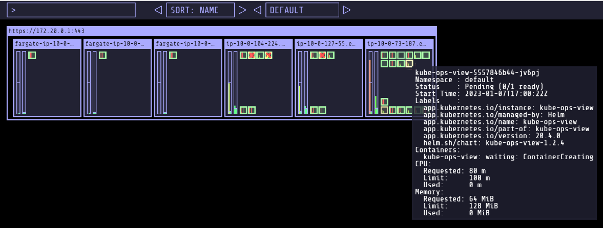

- Delete frontend-fargate & Kubernetes Operational View(kube-ops-view)

```bash
kubectl delete -f frontend-deployment-fargate.yaml
kubectl delete -f frontend-service-fargate.yaml
helm list
helm uninstall kube-ops-view
  NAME                                       READY   STATUS    RESTARTS   AGE
  pod/demo-flask-backend-788c6f99f4-7z958    1/1     Running   0          11m
  pod/demo-frontend-78c4757ff7-49d5p         1/1     Running   0          7h9m
  pod/demo-frontend-78c4757ff7-4tflq         1/1     Running   0          7h9m
  pod/demo-frontend-78c4757ff7-9dhsz         1/1     Running   0          7h9m
  pod/demo-nodejs-backend-7b5c469d54-gnv5k   1/1     Running   0          11m
  pod/demo-nodejs-backend-7b5c469d54-nkzzv   1/1     Running   0          11m
  pod/demo-nodejs-backend-7b5c469d54-th4pm   1/1     Running   0          9h

  NAME                          TYPE        CLUSTER-IP       EXTERNAL-IP   PORT(S)          AGE
  service/demo-flask-backend    NodePort    172.20.230.0     <none>        8080:31346/TCP   10h
  service/demo-frontend         NodePort    172.20.211.20    <none>        80:30212/TCP     8h
  service/demo-nodejs-backend   NodePort    172.20.252.177   <none>        8080:31657/TCP   9h
  service/kubernetes            ClusterIP   172.20.0.1       <none>        443/TCP          30h

  NAME                                  READY   UP-TO-DATE   AVAILABLE   AGE
  deployment.apps/demo-flask-backend    1/1     1            1           10h
  deployment.apps/demo-frontend         3/3     3            3           7h9m
  deployment.apps/demo-nodejs-backend   3/3     3            3           9h

  NAME                                             DESIRED   CURRENT   READY   AGE
  replicaset.apps/demo-flask-backend-5754d55b8b    0         0         0       10h
  replicaset.apps/demo-flask-backend-788c6f99f4    1         1         1       146m
  replicaset.apps/demo-frontend-78c4757ff7         3         3         3       7h9m
  replicaset.apps/demo-nodejs-backend-7b5c469d54   3         3         3       9h

  NAME                                                         REFERENCE                       TARGETS   MINPODS   MAXPODS   REPLICAS   AGE
  horizontalpodautoscaler.autoscaling/demo-flask-backend-hpa   Deployment/demo-flask-backend   3%/30%    1         5         1          144m
```

## CI/CD for EKS cluster

### CI/CD pipeline for EKS Cluster / Kubernetes Cluster

On top of that, the goal CI/CD pipeline in this tutorial will automatically detect application code changes in Github, and then trigger Github Action to integrate and buid the code changes. At the end, ArgoCD will be subsequently executed to deploy built artifacts to the target, EKS cluster. For pieces of block helping to automate this flow, we will introduce Kustomize that is tool to package kubernetes manifest up, Checkov and Tryvy for static analysis to secure EKS cluster running on.

- GitHub
- GitHub Actions
- Kustomize
- ArgoCD
- Checkov
- Trivy.

The goal of CI/CD pipeline will like below, which is also called as gitops flow.

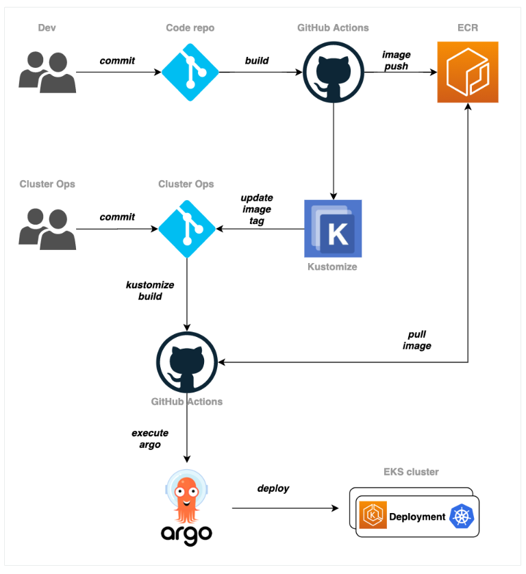

### CI/CD pipeline for EKS Cluster / Kubernetes Cluster with cdk helm

On top of that, the goal CI/CD pipeline in this tutorial will automatically detect application code changes in CodeCommit, and then trigger Codebuild to integrate and buid the code changes. At the end, ArgoCD will be subsequently executed to deploy built artifacts to the target, EKS cluster. For pieces of block helping to automate this flow, we will introduce Helm that is tool to package kubernetes manifest up, Checkov and Tryvy for static analysis to secure EKS cluster running on.

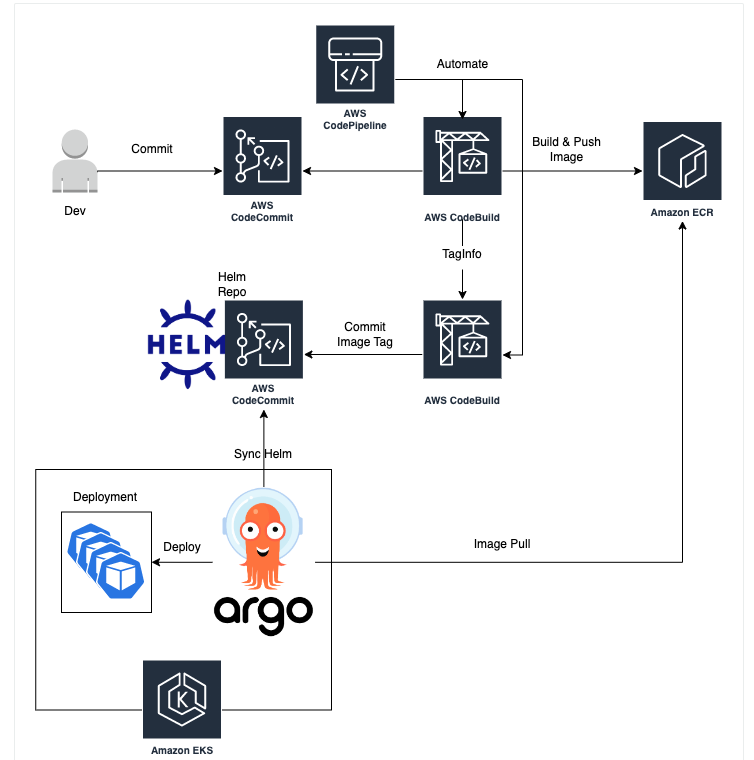

### Create CI/CD pipeline

#### Build up CI/CD pipeline

1. Create two git repository for application, kubernetes manifest each
We need to have two github repository in place.

amazon-eks-cicd-front-app: located front-end application source code in
amazon-eks-cicd-manifest: located kubernetes manifest files in

```bash
cd amazon-eks-frontend-main 
git init
git add .
git commit -m "first commit"
git branch -M main
git remote add origin https://github.com/quansang/amazon-eks-cicd-front-app.git
git push -u origin main
```

2. Prepare least privilege IAM to use in CI/CD pipeline
3. Create githup secrets(AWS Credential, github token)

- Generate AWS Credential
- Generate gitHub personal token
  - Once log in github.com, naviate profile > Settings > Developer settings > Personal access tokens. Finally, click on Generate new token in the top right corner.
  - Type access token for github action in Note, and then select repo in Select scopes. Finally, click Generate token
  - Copy value of token in the output.
- Set up gitHub secret
  - Go back to amazon-eks-cicd-front-app repository and navigate Settings > Secrets. And click New repository secret in the top right corner.
  - As below screen shot, put ACTION_TOKEN, personal access token in Name, Value respectively.(*You must have copied personal access token in the previous step). Finally click Add secret
  - Similar way, store both AccessKeyId and SecretAccessKey that github-action will use in gitHub secret. Note that Name of AccessKeyId and SecretAccessKey must be AWS_ACCESS_KEY_ID, AWS_SECRET_ACCESS_KEY each.

4. Make build script for gitHub Action to use
(1) Make .github directory
(2) Make build.yaml for gitHub Action to use

- Most eye-catching part in the script is procedure to dynamically put docker image tag. We intend to have $IMAGE_TAG that is dynamically and randomly created to attach docker image built.

```bash
name: Build Front

on:
  push:
    branches: [ main ]

jobs:
  build:
    runs-on: ubuntu-latest
    steps:
      - name: Checkout source code
        uses: actions/checkout@v2

      - name: Check Node v
        run: node -v

      - name: Build front
        run: |
          npm install
          npm run build

      - name: Configure AWS credentials
        uses: aws-actions/configure-aws-credentials@v1
        with:
          aws-access-key-id: ${{ secrets.AWS_ACCESS_KEY_ID }}
          aws-secret-access-key: ${{ secrets.AWS_SECRET_ACCESS_KEY }}
          aws-region: us-east-1

      - name: Login to Amazon ECR
        id: login-ecr
        uses: aws-actions/amazon-ecr-login@v1

      - name: Get image tag(verion)
        id: image
        run: |
          VERSION=$(echo ${{ github.sha }} | cut -c1-8)
          echo VERSION=$VERSION
          echo "::set-output name=version::$VERSION"

      - name: Build, tag, and push image to Amazon ECR
        id: image-info
        env:
          ECR_REGISTRY: ${{ steps.login-ecr.outputs.registry }}
          ECR_REPOSITORY: demo-frontend
          IMAGE_TAG: ${{ steps.image.outputs.version }}
        run: |
          echo "::set-output name=ecr_repository::$ECR_REPOSITORY"
          echo "::set-output name=image_tag::$IMAGE_TAG"
          docker build -t $ECR_REGISTRY/$ECR_REPOSITORY:$IMAGE_TAG .
          docker push $ECR_REGISTRY/$ECR_REPOSITORY:$IMAGE_TAG
```

(3) Run gitHub Action workflow

```bash
git add .
git commit -m "Add github action build script"
git push origin main
```

5. Kustomize Overview
In this tutorial, we are going to use Kustomize to simply inject same value of label, metadata, etc. into kubernetes Deployment objects. This helps us to avoid hassle job to modify mannually value in each of kubernetes objects. Most importantly, we are to use Kustomize to not only automatically, but also dynamically assign image tag to kubernetes Deployment.

6. Structure directories for Kustomize
(1) Make directories

- Now that kubernetes manifest owns seperated github repository. On top of that, we are going to package it to deploy using Kustomize. For this we need to make directories that Kustomize can run accordingly. The struction of directories should follow predefined naming rule.

```bash
cd manifests
mkdir -p manifests/overlays/dev
ls -rlt
```

- Outcome of directories has base and overlays/dev under manifests.
  - base : raw kubernetes manifest files are here. During kustomize build process, those files in here will be automatically modified along with customized content by users in kustomize.yaml under overlays.
  - overlays : customized content by users is in kustomize.yaml under this directory. Also note that dev directory is to put all relevant files for deploying to dev environment. In this tutorial, we assume that we deploy to dev environment accordingly.

(2) Make Kustomize manifest files

- Remember the goal of this tutorial is to make deployment pipeline for front-end application. So, we will change and replace some values in frontend-deployment.yaml and frontend-service.yaml with values we intend to inject during deployment step(e.g. image tag). These are values we are definitely to inject dynamically into associated kubernetes manifest files.
  - metadata.labels: "env: dev" will be reflected to frontend-deployment.yaml, frontend-service.yaml
  - spec.selector : "select.app: frontend-fargate" will be reflected to frontend-deployment.yaml, frontend-service.yaml
  - spec.template.spec.containers.image : "image: " with newly created image tag will be reflected to frontend-deployment.yaml

- Make kustomize.yaml as below. Main purpose of this file is to define target files to be automatically injected by kustomize.

```bash
cd manifests/base
cat kustomization.yaml
```

- Next, it's time to make files to `dev`

```bash
cd manifests/overlays/dev
cat front-deployment-patch.yaml
cat front-deployment-patch.yaml
cat kustomization.yaml
```

7. Setup gitHub repo for kubernetes manifest

```bash
cd manifests
git init
git add .
git commit -m "first commit"
git branch -M main
git remote add origin https://github.com/quansang/amazon-eks-cicd-manifest.git
git push -u origin main
```

8. Set up ArgoCD
(1) Install ArgoCD in EKS cluster

- Run this code to install ArgoDC in EKS cluster.

```bash
kubectl create namespace argocd
kubectl apply -n argocd -f https://raw.githubusercontent.com/argoproj/argo-cd/stable/manifests/install.yaml
```

- ArgoCD also provides CLI to users. Install ArgoCD CLI, we are not using it in this tutorial going on though.

```bash
VERSION=$(curl --silent "https://api.github.com/repos/argoproj/argo-cd/releases/latest" | grep '"tag_name"' | sed -E 's/.*"([^"]+)".*/\1/')
sudo curl --silent --location -o /usr/local/bin/argocd https://github.com/argoproj/argo-cd/releases/download/$VERSION/argocd-linux-amd64
sudo chmod +x /usr/local/bin/argocd
```

- Basically ArgoCD is not directly exposed to external, so we need to set up ELB in front of ArgoCD for incoming transactions.

```bash
kubectl patch svc argocd-server -n argocd -p '{"spec": {"type": "LoadBalancer"}}'
```

- It may take 3~4 mins to be reachable via ELB. Run this code to get the URL of ELB.

```bash
export ARGOCD_SERVER=`kubectl get svc argocd-server -n argocd -o json | jq --raw-output '.status.loadBalancer.ingress[0].hostname'`
echo $ARGOCD_SERVER

  a06210d3fa7b249b2bfad2f0c7fccc1f-1218216419.us-east-1.elb.amazonaws.com
```

- ArgoCD default username is admin. Get password against it with this command.

```bash
ARGO_PWD=`kubectl -n argocd get secret argocd-initial-admin-secret -o jsonpath="{.data.password}" | base64 -d`
echo $ARGO_PWD
```

9. Configure ArgoCD
(1) Configure ArgoCD

- After logging in, Click Applicaions to configure in the top left corner.
- Next, input basic information about target deployment of application. Application Name and Project should be eksworkshop-cd-pipeline and default each.
- Repository URL , Revision, Path in section of SOURCE must be git address of <https://github.com/quansang/amazon-eks-cicd-manifest.git>, main, and overlays/dev each.
- Cluster URL and Namespace in section of DESTINATION must be <https://kubernetes.default.svc> and default each. After input, click Create

Note: If out of sync, update real tag in `kustomization.yaml`

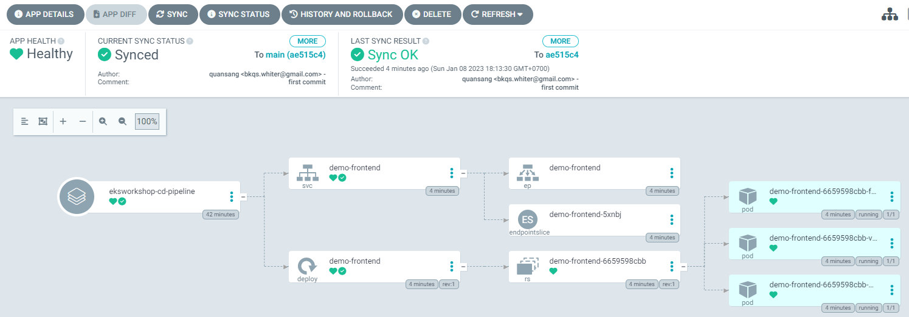

10. Add Kustomize build step
(1) Improve gitHub Action build script Add this code in build.yaml for amazon-eks-cicd-front-app. This code will update container image tag in kubernetes manifest files using kustomize. After that, it will commit and push those files to amazon-eks-cicd-manifest.

- When it successfully finishes, ArgoCD watching amazon-eks-cicd-manifest will catch the new update and start deployment process afterward.

```bash
cd amazon-eks-frontend-main/.github/workflows
cat build.yaml

      - name: Setup Kustomize
        uses: imranismail/setup-kustomize@v1

      - name: Checkout kustomize repository
        uses: actions/checkout@v2
        with:
          repository: quansang/amazon-eks-cicd-manifest
          ref: main
          token: ${{ secrets.ACTION_TOKEN }}

      - name: Update Kubernetes resources
        run: |
          echo ${{ steps.login-ecr.outputs.registry }}
          echo ${{ steps.image-info.outputs.ecr_repository }}
          echo ${{ steps.image-info.outputs.image_tag }}
          cd overlays/dev/
          kustomize edit set image ${{ steps.login-ecr.outputs.registry }}/${{ steps.image-info.outputs.ecr_repository }}=${{ steps.login-ecr.outputs.registry}}/${{ steps.image-info.outputs.ecr_repository }}:${{ steps.image-info.outputs.image_tag }}
          cat kustomization.yaml

      - name: Commit files
        run: |
          git config --global user.email "github-actions@github.com"
          git config --global user.name "github-actions"
          git commit -am "Update image tag"
          git push -u origin main
```

(2) Commit&push to amazon-eks-cicd-front-app

- Commit and push newly improved build.yaml to amazon-eks-cicd-front-app to run gitHub Action workflow.

(3) Check github action

- Check if gitHub Action workflow works fine.

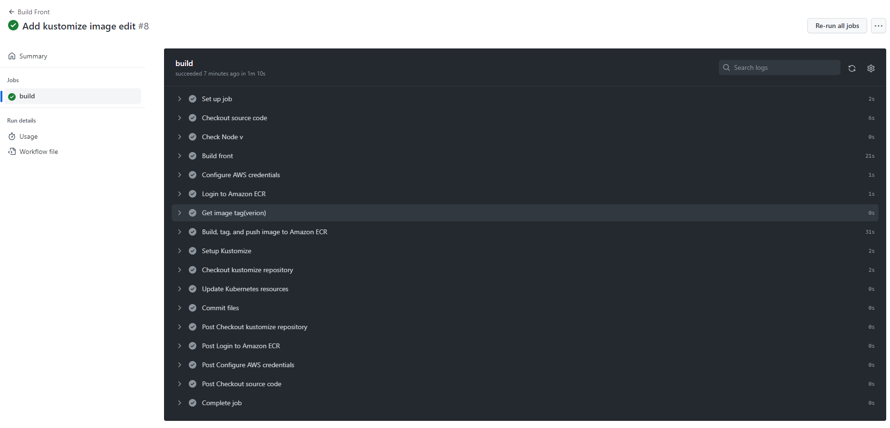

(4) Check amazon-eks-cicd-manifest

- Check if amazon-eks-cicd-manifest's latest commit is derived from gitHub Action workflow of amazon-eks-cicd-front-app.

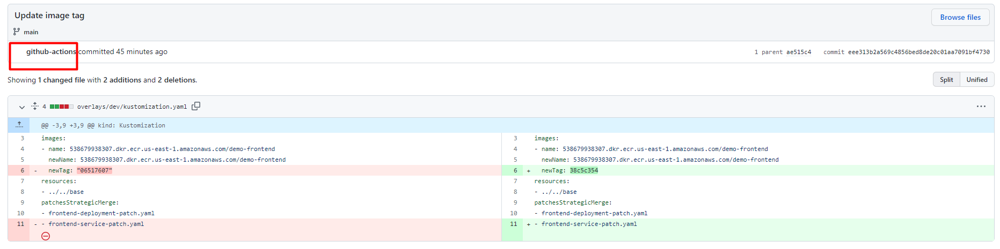

(5) Check ArgoCD

- Return to ArgoCD UI. Navigate Applications > eksworkshop-cd-pipeline. Now CURRENT SYNC STATUS is Out of Synced.
- To run sync job automatically, we need to enable Auto-Sync. To do so, go to APP DETAILS and click ENABLE AUTO-SYNC.
- From now on, on commit in k8s-manifest-repo, ArgoCD automatically deploy the commit to EKS Cluster.

11. Check CI/CD pipeline working from end to end

Let's test out whole gitops pipeline we've built by making code changes in front-end application.

(1) Change code

- Move to amazon-eks-frontend-main/src/ and open App.js in folder tree of the left pane. Replace code at line 67 with EKS DEMO Blog version 1 and save it.

(2) Commit and push

```bash
cd amazon-eks-frontend-main
git add .
git commit -m "Add new blog version"
git push -u origin main
```

(3) Check CI/CD pipeline and application

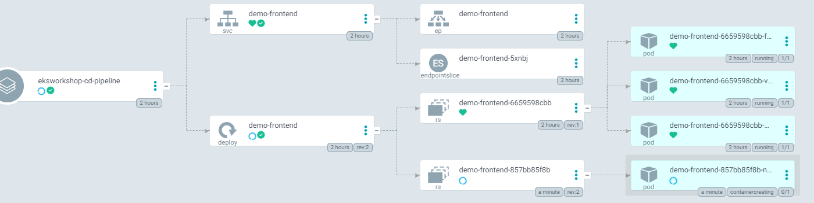

## CI/CD with security

### Improve CI/CD pipeline with security implementation

- Prior to deploying kubernetes manifest files to EKS Cluster, supplementary steps need to be added to prevent security and misconfiguration issue by using both Checkov  and Trivy . Also, we will use seperate ArgoCD account from admin user that we've used in the previous lab. This will follow ArgoCD RBAC rule to secure ArgoCD and EKS cluster ultimately.
- For this, we will need to improve CD (Continuous Deploy) process as follows.
  - On application code change, new docker image with new image tag is created
  - Trivy inspects security vulnerability of the new image
  - Kustomize starts making kubernetes manifest files with the new image information
  - Checkov inspects security vulnerability and misconfiguration of kubernetes manifest files
  - If no issue out there, ArgoCD starts sync job to deploy
- Each of steps above is ran in the different gitHub Action workflow
  - 1~2 : github Action workflow of application repository
  - 3~5 : github Action workflow of manifest repository
- We will conduct followings to build it up.
  - Improve gitHub Action build script in frontend application repository
  - Improve gitHub Action build script in k8s manifest repository
  - Deactivate ArgoCD AUTO_SYNC (Manual)
  - Create new ArgoCD account
  - Create auth-token for new ArgoCD account
  - Configure Argo RBAC for new ArgoCD account

1. Improve gitHub Action build script in frontend application repository

- We need additional step to ensure that newly created docker image has no security vulnerability prior to pushing it to ECR. For this we will modify build.yaml to add image scanning process using Trivy

```bash
cat build-security.yaml

name: Build Front

on:
  push:
    branches: [ main ]

jobs:
  build:
    runs-on: ubuntu-latest
    steps:
      - name: Checkout source code
        uses: actions/checkout@v2

      - name: Check Node v
        run: node -v

      - name: Build front
        run: |
          npm install
          npm run build

      - name: Configure AWS credentials
        uses: aws-actions/configure-aws-credentials@v1
        with:
          aws-access-key-id: ${{ secrets.AWS_ACCESS_KEY_ID }}
          aws-secret-access-key: ${{ secrets.AWS_SECRET_ACCESS_KEY }}
          aws-region: us-east-1

      - name: Login to Amazon ECR
        id: login-ecr
        uses: aws-actions/amazon-ecr-login@v1

      - name: Get image tag(verion)
        id: image
        run: |
          VERSION=$(echo ${{ github.sha }} | cut -c1-8)
          echo VERSION=$VERSION
          echo "::set-output name=version::$VERSION"

      - name: Build, tag, and push image to Amazon ECR
        id: image-info
        env:
          ECR_REGISTRY: ${{ steps.login-ecr.outputs.registry }}
          ECR_REPOSITORY: demo-frontend
          IMAGE_TAG: ${{ steps.image.outputs.version }}
        run: |
          echo "::set-output name=ecr_repository::$ECR_REPOSITORY"
          echo "::set-output name=image_tag::$IMAGE_TAG"
          docker build -t $ECR_REGISTRY/$ECR_REPOSITORY:$IMAGE_TAG .


      - name: Run Trivy vulnerability scanner
        uses: aquasecurity/trivy-action@master
        with:
          image-ref: '${{ steps.login-ecr.outputs.registry}}/${{ steps.image-info.outputs.ecr_repository }}:${{ steps.image-info.outputs.image_tag }}'
          format: 'table'
          exit-code: '0'
          ignore-unfixed: true
          vuln-type: 'os,library'
          severity: 'CRITICAL,HIGH'

      - name: Push image to Amazon ECR
        run: |
          docker push ${{ steps.login-ecr.outputs.registry}}/${{ steps.image-info.outputs.ecr_repository }}:${{ steps.image-info.outputs.image_tag }}

      - name: Setup Kustomize
        uses: imranismail/setup-kustomize@v1

      - name: Checkout kustomize repository
        uses: actions/checkout@v2
        with:
          repository: quansang/amazon-eks-cicd-manifest
          ref: main
          token: ${{ secrets.ACTION_TOKEN }}

      - name: Update Kubernetes resources
        run: |
          echo ${{ steps.login-ecr.outputs.registry }}
          echo ${{ steps.image-info.outputs.ecr_repository }}
          echo ${{ steps.image-info.outputs.image_tag }}
          cd overlays/dev/
          kustomize edit set image ${{ steps.login-ecr.outputs.registry }}/${{ steps.image-info.outputs.ecr_repository }}=${{ steps.login-ecr.outputs.registry }}/${{ steps.image-info.outputs.ecr_repository }}:${{ steps.image-info.outputs.image_tag }}
          cat kustomization.yaml

      - name: Commit files
        run: |
          git config --global user.email "github-actions@github.com"
          git config --global user.name "github-actions"
          git commit -am "Update image tag"
          git push -u origin main
```

- Commit&push

```bash
git add .
git commit -m "Add Image Scanning in build.yaml"
git push -u origin main
```

- Afterwards, gitHub Action workflow will be executed and it shows the result of image scan.

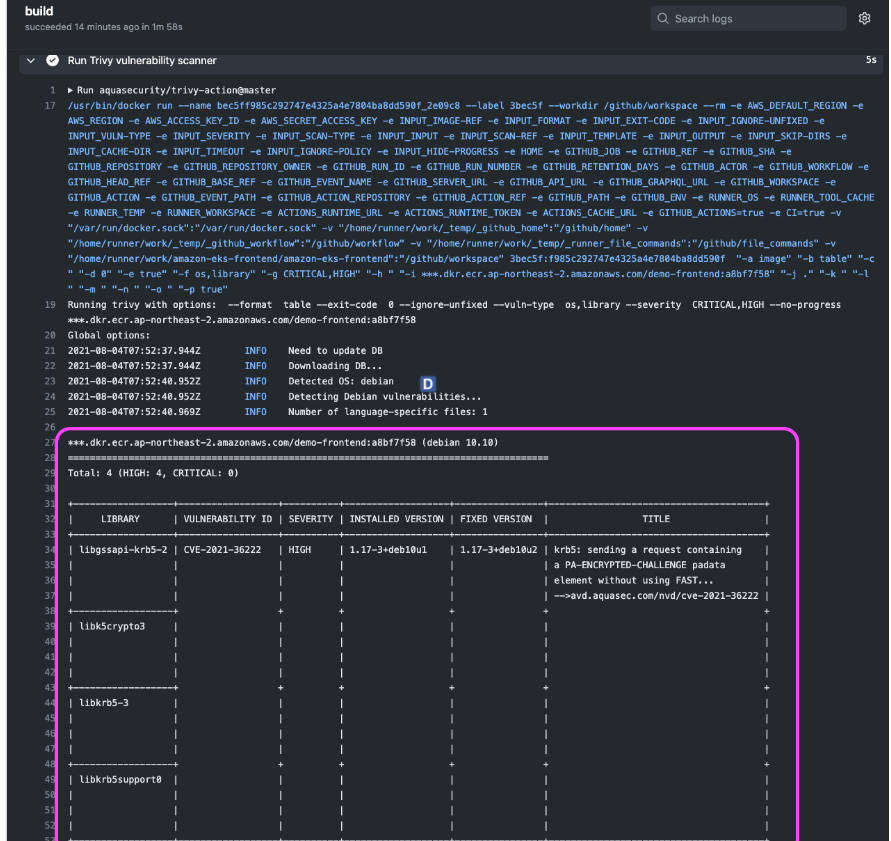

1. Improve gitHub Action build script in manifest repository

```bash
cd manifests
mkdir -p ./.github/workflows
cd .github/workflows
cat build.yaml

name: "ArgoCD sync"
on: "push"

jobs:
  build:
    runs-on: ubuntu-latest
    steps:

      - name: Checkout source code
        uses: actions/checkout@v2

      - name: Setup Kustomize
        uses: imranismail/setup-kustomize@v1

      - name: Build Kustomize
        run: |
          pwd
          mkdir kustomize-build
          kustomize build ./overlays/dev > ./kustomize-build/kustomize-build-output.yaml
          ls -rlt
          cd kustomize-build
          cat kustomize-build-output.yaml

      - name: Run Checkov action
        id: checkov
        uses: bridgecrewio/checkov-action@master
        with:
          directory: kustomize-build/
          framework: kubernetes

      - name: Install ArgoCD and execute Sync in ArgoCD
        run: |
          curl -sSL -o /usr/local/bin/argocd https://github.com/argoproj/argo-cd/releases/latest/download/argocd-linux-amd64
          chmod +x /usr/local/bin/argocd
          argocd app sync eksworkshop-cd-pipeline --auth-token ${{ secrets.ARGOCD_TOKEN }} --server a06210d3fa7b249b2bfad2f0c7fccc1f-1218216419.us-east-1.elb.amazonaws.com --insecure
```

3. Deactivate ArgoCD AUTO_SYNC (Manual)

- Go to Applicaiton > eksworkshop-cd-pipeline and then click APP DETAIL. Next, change SYNC_POLICY with DISABLE AUTO-SYNC

4. Create new ArgoCD account
To increase security of ArgoCD, we will use seperate ArgoCD account from admin user we used. Also we add role on top of the account.

New account name of ArgoCD for CI/CD pipeline is devops

ArgoCD allows us to add account via Configmap tha ArgoCD is using in the cluster.

- Run this code & add this code below apiVersion: v1

```bash
kubectl -n argocd edit configmap argocd-cm -o yaml

data:
  accounts.devops: apiKey,login
```

5. Create auth-token for new ArgoCD account
Let's generate auth-token that new ArgoCD account, devops is using. This will be used for authentication token when we make api call to ArgoCD. So this is different credential from login password for ArgoCD UI.

- Run this code and make a note of the output so that we can continue to use it

```bash
argocd login $ARGOCD_SERVER

  Fill admin/password

argocd account generate-token --account devops
```

- To save token value from the output in Secrets of kubernetes maniffest repository, go to Settings > Secrets, and then click New repository secret. Finally, input ARGOCD_TOKEN and saved token value into Name and Values each, and then click Add Secret

6. Configure Argo RBAC for new ArgoCD account
The new ArgoCD account we've created has no permission to make API call to sync. So, we need to grant it permission according to RBAC of ArgoCD.

- To grant permission, run this code to modify argocd-rbac-cm, ArgoCD Configmap & add this code below apiVersion: v1

```bash
kubectl -n argocd edit configmap argocd-rbac-cm -o yaml

data:
  policy.csv: |
    p, role:devops, applications, *, */*, allow
    p, role:devops, clusters, get, *, allow
    p, role:devops, repositories, get, *, allow
    p, role:devops, repositories, create, *, allow
    p, role:devops, repositories, update, *, allow
    p, role:devops, repositories, delete, *, allow

    g, devops, role:devops
  policy.default: role:readonly
```

7. Check new implementation working

- Commit and push the code

```bash
cd manifests
git add .
git commit -m "Add github action with ArgoCD"
git push -u origin main
```

- See if gitHub Action workflow completes and trigger ArgoCD deployment process.
- gitHub Action workflow run into failure error as below. This is the result from Checkov 's static analysis on kubernetes manifest files. The result comes along with warning messages based on security best practice which is predefined in Checkov.

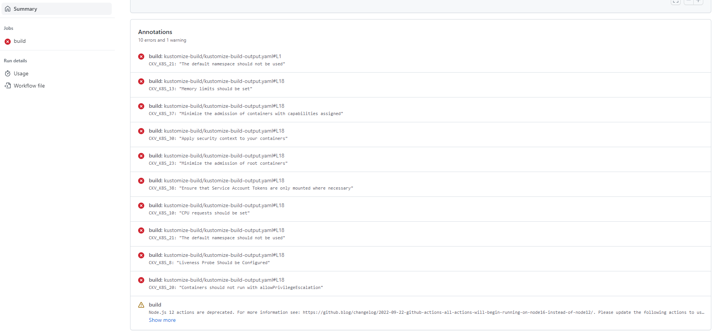

- Since we confirmed Checkov works expectedly, we will narrow down the scope of analysis for lab purpose.
- Run this code to scope Checkov analysis to CKV_K8S_17 & add below `framework: kubernetes`

```bash
cd manifests/.github/workflows
vi build.yaml

          check: CKV_K8S_17 #check only CKV_K8S_17
```

- Commit and push the code

```bash
cd manifests
git add .
git commit -m "Chage Checkov check scope"
git push -u origin main
```

- See if gitHub Action workflow completes and trigger ArgoCD deployment process. This time, ArgoCD will be successfully completed without interruption.

8. Test out end-to-end pipeline working
Let's test out end-to-end pipeline working with code change on front-end application first.

(1) front-end application code change

- move to amazon-eks-frontend/src/ and open App.js in folder tree of the left pane. Replace code at line 67 with EKS DEMO Blog version 2 and save it.

(2) commit and push

```bash
cd amazon-eks-frontend-main
git add .
git commit -m "Add new blog version 2"
git push -u origin main
```

- See if gitHub Action workflow completes and trigger ArgoCD deployment process. This time, ArgoCD will be successfully completed without interruption.

## Clean up resources

- Delete the Ingress resources. At this point, perform the command in the folder where the yaml file is located(/manifests).

```bash
cd manifests/base

kubectl delete -n argocd -f https://raw.githubusercontent.com/argoproj/argo-cd/stable/manifests/install.yaml
kubectl delete -f cluster-autoscaler-autodiscover.yaml\n
kubectl delete -f flask-hpa.yaml\n
kubectl delete -f https://github.com/kubernetes-sigs/metrics-server/releases/latest/download/components.yaml\n
kubectl delete -f cloudwatch-insight/cwagent-fluent-bit-quickstart.yaml \n
kubectl delete -f frontend-deployment-fargate.yaml
kubectl delete -f frontend-service-fargate.yaml
kubectl delete -f alb-ingress-controller/v2_4_4_full.yaml
kubectl delete -f alb-ingress-controller/https://github.com/jetstack/cert-manager/releases/download/v1.5.4/cert-manager.yaml
kubectl delete -f flask-ingress.yaml
kubectl delete -f frontend-ingress.yaml
kubectl delete -f nodejs-ingress.yaml
```

- Delete EKS cluster.

```bash
eksctl delete cluster --name=eks-demo --region us-east-1
```

Note: If cannot delete cluster. Enter to Cloudformation -> choose failed stack -> Detach NodeInstanceRole
eksctl-eks-demo-nodegroup-node-gr-NodeInstanceRole-1MJUR9YSDUCSH. Retry delete

- Remove Amazon ECR repository. With the command below, load the list of repository that you created.

```bash
aws ecr describe-repositories --region us-east-1
aws ecr delete-repository --repository-name demo-flask-backend --force --region us-east-1
aws ecr delete-repository --repository-name demo-frontend --force --region us-east-1
aws ecr delete-repository --repository-name demo-nodejs-backend --force --region us-east-1
```

- Delete the collected metrics.

```bash
aws logs describe-log-groups --query 'logGroups[*].logGroupName' --output table --region us-east-1 | \
awk '{print $2}' | grep ^/aws/containerinsights/eks-demo | while read x; do  echo "deleting $x" ; aws logs delete-log-group --log-group-name $x --region us-east-1; done

aws logs describe-log-groups --query 'logGroups[*].logGroupName' --output table --region us-east-1 | \
awk '{print $2}' | grep ^/aws/eks/eks-demo | while read x; do  echo "deleting $x" ; aws logs delete-log-group --log-group-name $x --region us-east-1; done
```
